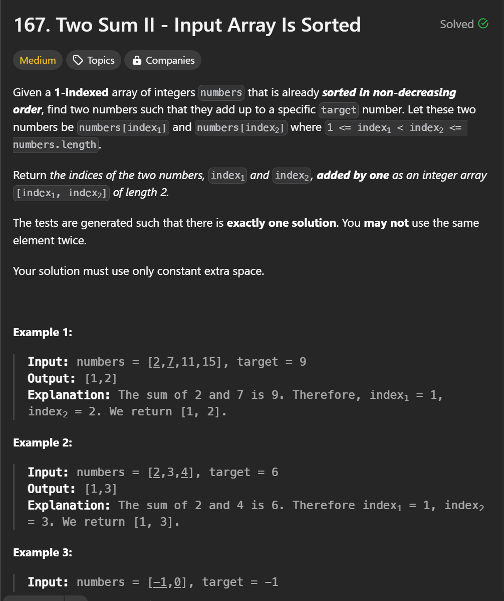
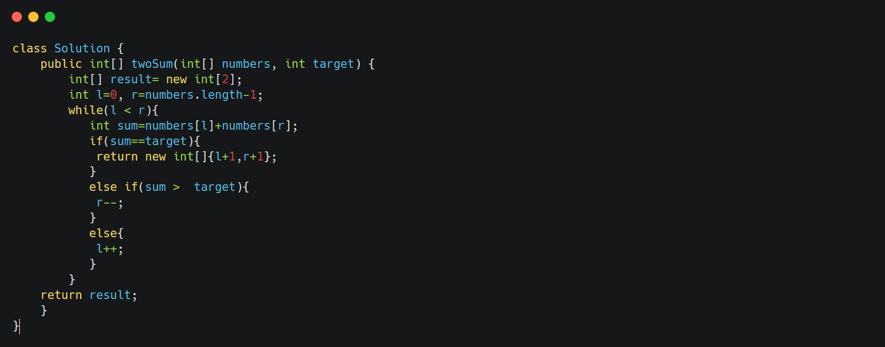

&nbsp;

Given a sorted array of integers `numbers` and a target integer `target`, find the indices of the two numbers such that they add up to the target. The indices are 1-based, meaning the first element is at index 1.  
 Input array is sorted

&nbsp;

&nbsp;

Solution

&nbsp;

