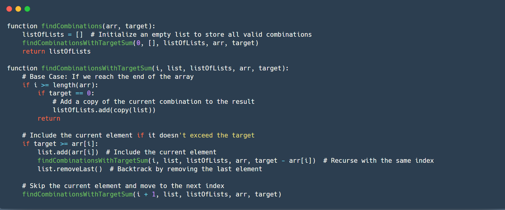
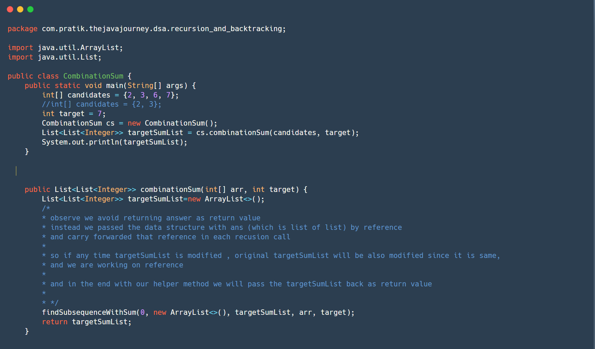
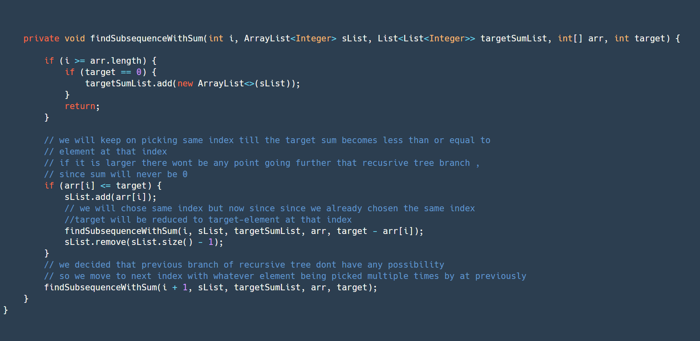

### **Problem Statement**

Given an array of distinct integers `candidates` and a target integer `target`, find all unique combinations in `candidates` where the numbers sum to `target`. Each number in `candidates` may be used **unlimited times** in the combination.

#### Constraints:

1.  All numbers (including the target) are positive integers.
2.  The solution set must not contain duplicate combinations.
3.  The order of the combinations does not matter.

&nbsp;

```
Input: candidates = [2, 3, 6, 7], target = 7
Output: [[2, 2, 3], [7]]
Explanation:
- 2 + 2 + 3 = 7
- 7 = 7
Both combinations are valid, and there are no duplicates.
```

&nbsp;

&nbsp;Psudocode

&nbsp;



Solution:  
<br/>



&nbsp;