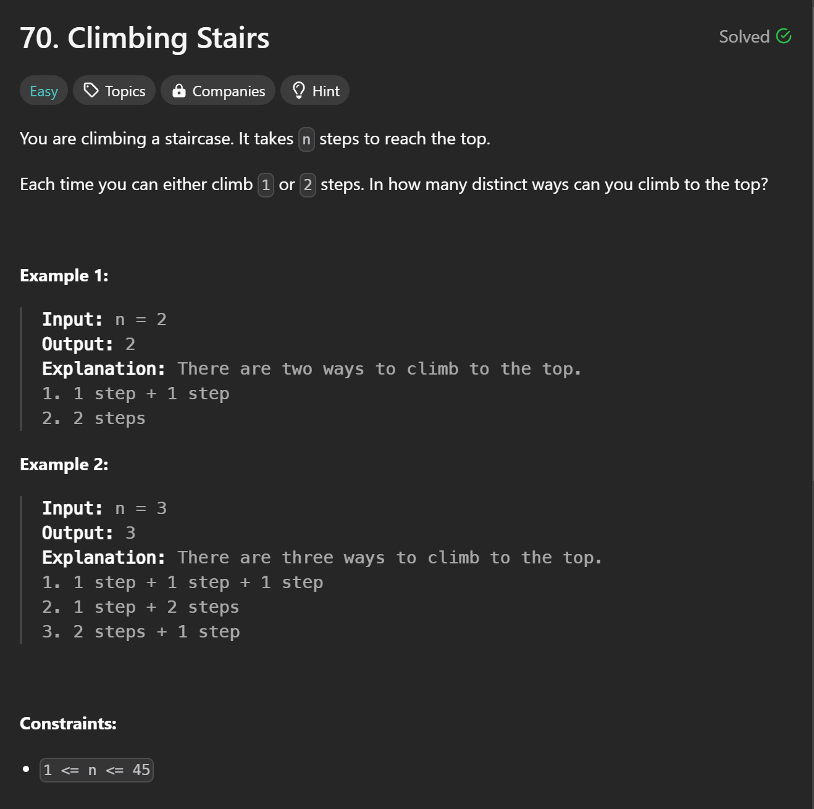

&nbsp;

&nbsp;

Solution:

&nbsp;

Let’s think about how you reach the top step (n).

Imagine you’re standing at step n (the top). How did you get there? You could have:

- Taken **1 step** from step n-1.
- Taken **2 steps** from step n-2.

&nbsp;

So, the number of ways to reach step n depends on:

- The number of ways to reach step n-1 (then take 1 step).
- The number of ways to reach step n-2 (then take 2 steps).

&nbsp;

Why is this a DP problem? Because:

- **Overlapping Subproblems**: Calculating ways(n) involves reusing ways(n-1) and ways(n-2), which themselves depend on earlier values.
- **Optimal Substructure**: The solution to the big problem (ways(n)) is built from solutions to smaller problems (ways(n-1) and ways(n-2)).

&nbsp;

There are two main DP approaches:

1.  **Top-Down (Recursion + Memoization)**: Start from n and recursively compute smaller cases, storing results to avoid recomputation.
2.  **Bottom-Up (Iterative)**: Start from base cases and build up to n.

&nbsp;

The bottom-up approach is often more efficient for this problem because it avoids recursion overhead and is straightforward. Let’s go with that.