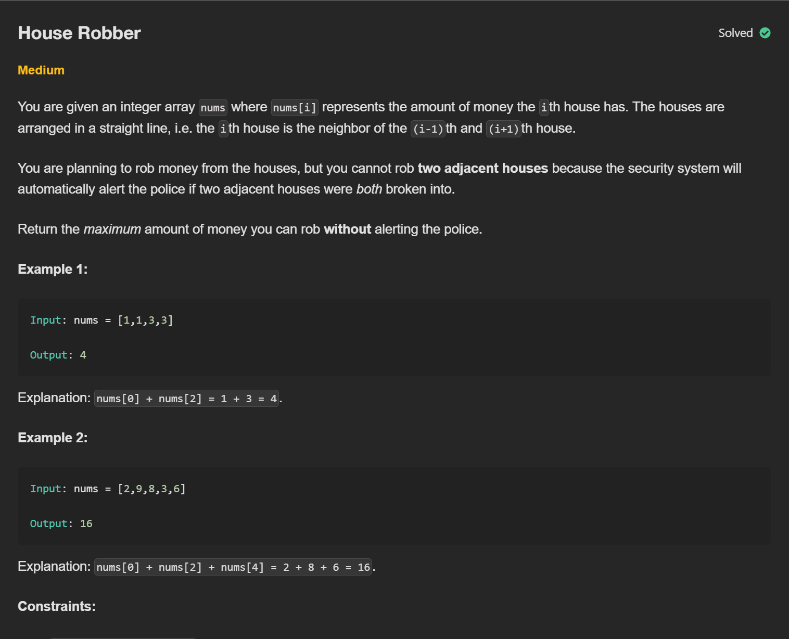
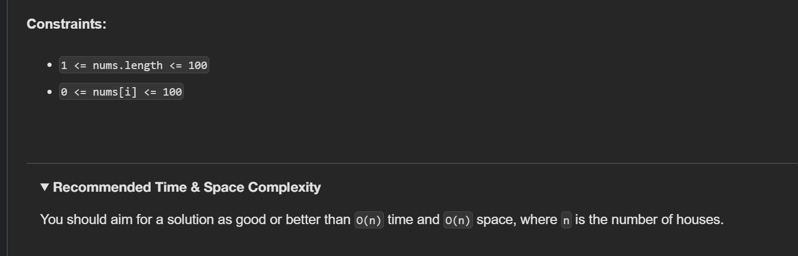
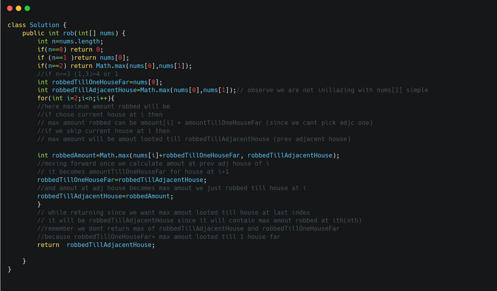

&nbsp;

**Decision at Each House:** When you arrive at house `i`, you have two fundamental choices:

- **Choice A: Rob house `i`**. If you do this, you *definitely* couldn't have robbed house `i-1`. So, the money you had *before* robbing house `i` must be the maximum amount you could have gotten from houses `0` to `i-2`. Total money for this choice: `nums[i] + max_money_up_to_house(i-2)`.
- **Choice B: Skip house `i`**. If you skip house `i`, you don't get `nums[i]`. The maximum money you can have is simply the maximum amount you could have gotten from houses `0` to `i-1` (since you didn't rob `i`, it doesn't matter if `i-1` was robbed or not). Total money for this choice: `max_money_up_to_house(i-1)`.

&nbsp;

&nbsp;

