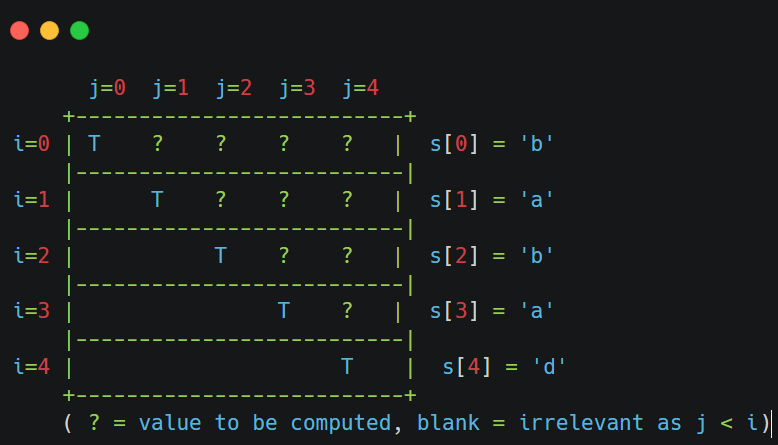
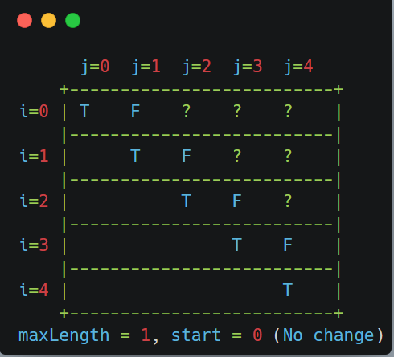
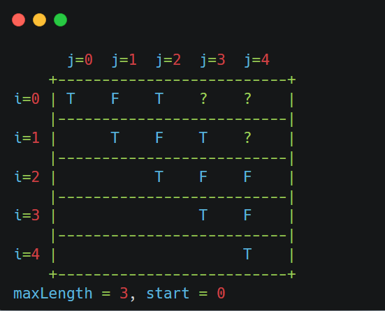

&nbsp;

&nbsp;

&nbsp;

&nbsp;

&nbsp;

we will maintain 2d array, 

will mark dp\[i\]\[j\] = true

&nbsp;

so for dp\[0\]\[0\], dp\[1\]\[1\], dp\[2\]\[2\], dp\[3\]\[3\]... dp\[i\]\[i\] they will be palindrome of length 1

similarly  dp\[0\]\[1\],  dp\[1\]\[2\], dp\[2\]\[3\], dp\[3\]\[4\]  will be of length 2;

for each substring  of length 2 we will check if is palindrome 

i.e s\[i\]==s\[i+1\] if true means it is palindrome

&nbsp;

&nbsp;

&nbsp;

for length 3 ,

`dp[0][2], dp[1][3], dp[2][4]`

//"bab", "aba", "bad" from "babad".

&nbsp;

vizualize dp\[0\]\[2\] :

==we will first check if outmost left and and right char of substring are equal or not==

i.e s\[i\]==s\[j\]

then we will ==check if the remaining substring== except for outermost left and right one is palindrome or not

and that we have already tabulated  dp\[1\]\[1\],  i.e = ==dp\[i+1\]\[j-1\]==

&nbsp;

`dp[i][j]= (s[i]==s[j]) && dp[i+1][j-1] `   // since we have already calculated truth value of dp\[i+1\]\[j-1\]

&nbsp;

&nbsp;

&nbsp;

&nbsp;