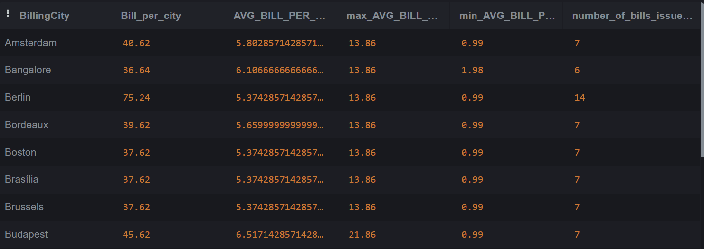

https://sqliteonline.com/ 

&nbsp;

&nbsp;

The `GROUP BY` clause is used to group rows that have the same values into summary rows.

```sql
SELECT country,COUNT(*) FROM Customer group by country;
```

&nbsp;


&nbsp;

* * *

## Aggregate Functions with GROUP BY

GROUP BY is usually used with aggregate functions like COUNT(), MAX(), MIN(), SUM(), AVG().

total here is billed amount  
<br/>

```sql
SELECT 
billingcity,
sum(total) as Bill_per_city,
avg(total) as AVG_BILL_PER_CITY,
max(total) as max_AVG_BILL_PER_CITY,
min(total) as min_AVG_BILL_PER_CITY,
count(*) as number_of_bills_issued_per_city
FROM Invoice
GROUP BY billingcity;
```



&nbsp;

&nbsp;

* * *

&nbsp;

Find composers having more than 10 tracks, column should have composer name and count of record in the output result

```sql
--find composers having more than 10 tracks
SELECT composer, count(*) 
FROM Track
group by composer having COUNT(*) > 10; 

```

