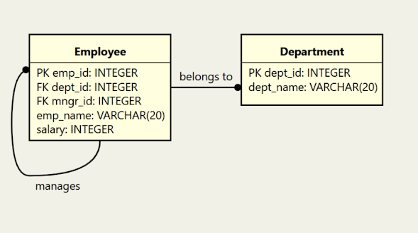
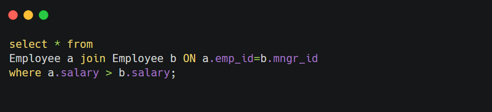
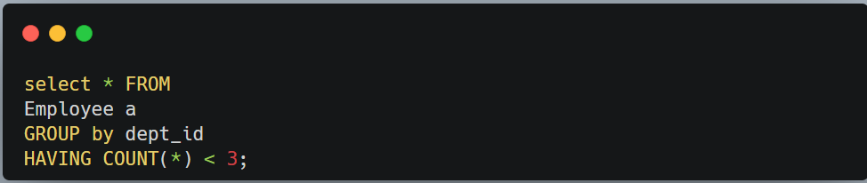
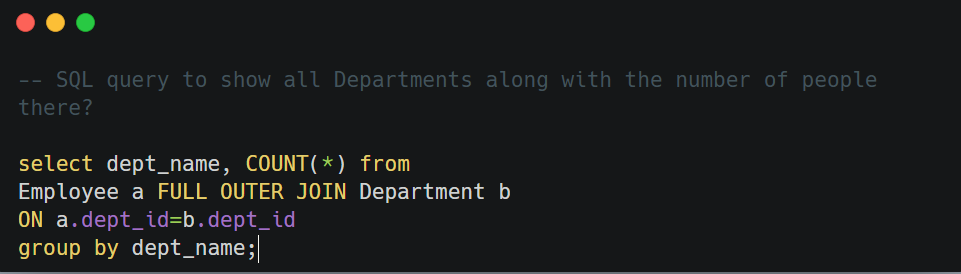
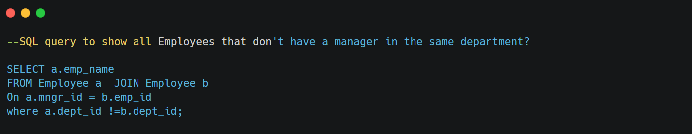
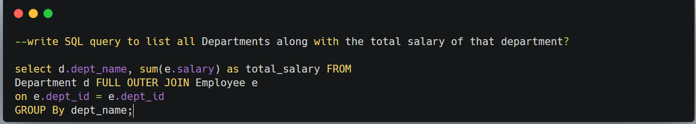
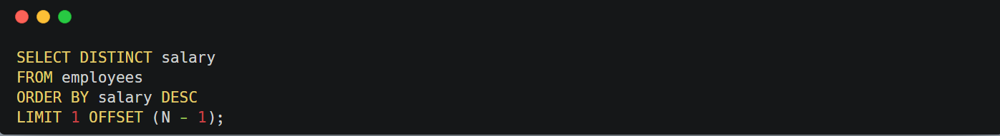

&nbsp;

**1\. Can you write an SQL query to show Employee (names) who have a bigger salary than their manager?**

In this problem, you need to compare employees' salaries to their manager's salary.

To achieve this, you need two instances of the same table. Also in order to find a Manager you need to compare employee id with manager id, this is achieved by using the self-join in SQL, where two instances of the same table are compared.

&nbsp;

* * *

2.

&nbsp;

&nbsp;

### 3.**SQL query to list Departments that have less than 3 people in it?**

&nbsp;

****

&nbsp;

&nbsp;

* * *

### 4\. SQL query to show all Departments along with the number of people there?

This is a tricky problem, candidates often use inner join to solve the problem, leaving out empty departments.

&nbsp;

&nbsp;

### 5.**SQL query to show all Employees that don't have a manager in the same department?**

&nbsp;

****

&nbsp;

* * *

&nbsp;

&nbsp;

&nbsp;

### 6.Can you write SQL query to list all Departments along with the total salary of that department?

&nbsp;

This problem is similar to the 4th question in this list. Here also you need to use OUTER JOIN instead of INNER join to include empty departments which should have no salaries.

&nbsp;

&nbsp;

* * *

&nbsp;

### Finding the Nth Highest Salary

To find the Nth highest salary in MySQL using `LIMIT` and `OFFSET`, we need to:

1.  Sort the salaries in descending order so that the highest salary comes first.
2.  Skip the first `(N - 1)` salaries using `OFFSET`.
3.  Retrieve the next salary (the Nth one) using `LIMIT`.

For example:

- If `N = 3`, we skip the top 2 salaries (`OFFSET 2`) and retrieve the 3rd salary (`LIMIT 1`).

&nbsp;