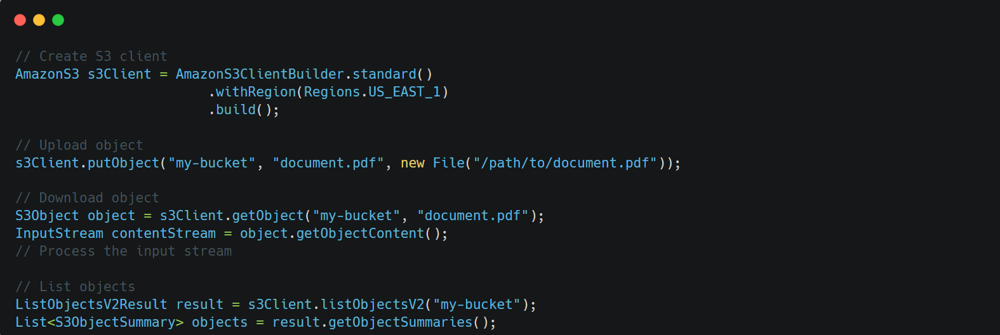
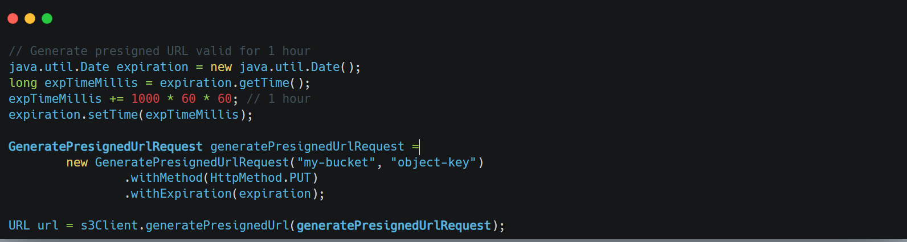
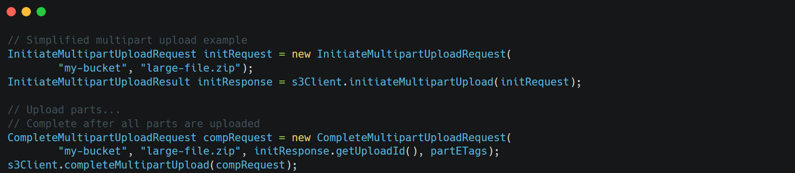

### What is S3?

S3 is ==AWS's object storage service designed for storing and retrieving any amount of data== from anywhere. Think of it as an infinitely scalable hard drive in the cloud.

### Key Concepts

1.  **Buckets**: Containers for storing objects (files)
    - Globally unique names
    - Region-specific
    - Unlimited objects in a bucket
2.  **Objects**: The actual files you store
    - Each object contains data, key (name), metadata
    - Size can range from 0 bytes to 5 TB
3.  **Access Control**:
    - IAM policies
    - Bucket policies
    - Access Control Lists (ACLs)
    - Presigned URLs

&nbsp;

&nbsp;

&nbsp;

&nbsp;

* * *

**How would you securely allow users to upload files directly to S3?** Answer: ==Use presigned URLs. These are temporary URLs that grant time-limited permission== to perform specific operations on S3 objects:

&nbsp;

&nbsp;

&nbsp;

**How would you handle large file uploads efficiently?** Answer: ==Use multipart uploads== for large files to improve throughput and resilience:

&nbsp;

* * *

&nbsp;

&nbsp;