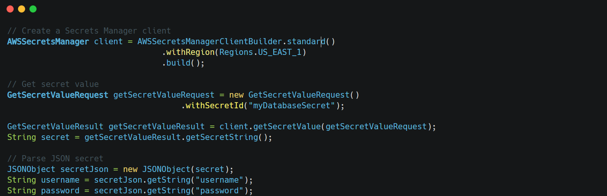

Secrets Manager is a service that helps you protect access to your applications, services, and IT resources without having to hardcode sensitive information in your code.

&nbsp;

### Key Features

1.  **Secret Storage**: Store API keys, passwords, tokens securely
2.  **Automatic Rotation**: Regularly update credentials without downtime
3.  **Fine-grained Access Control**: Through IAM policies
4.  **Encryption**: All secrets are encrypted at rest using KMS

&nbsp;

&nbsp;

&nbsp;

&nbsp;

**Why use Secrets Manager instead of storing credentials in environment variables?** Answer:

- Centralized secret management
- Automatic rotation
- Fine-grained access control
- Audit logging
- Encryption at rest and in transit
- No risk of environment variable leakage in logs or error messages

&nbsp;

&nbsp;

**How would you handle secret rotation in your application?** Answer: ==Always fetch secrets at runtime rather than caching them for long periods==. This ensures your application will use the latest credentials after rotation

&nbsp;

&nbsp;

&nbsp;

**How would you protect access to Secrets Manager itself?** Answer: Use IAM policies with the principle of least privilege to control which principals (users, roles, services) can access which secrets.

&nbsp;

&nbsp;

&nbsp;

&nbsp;