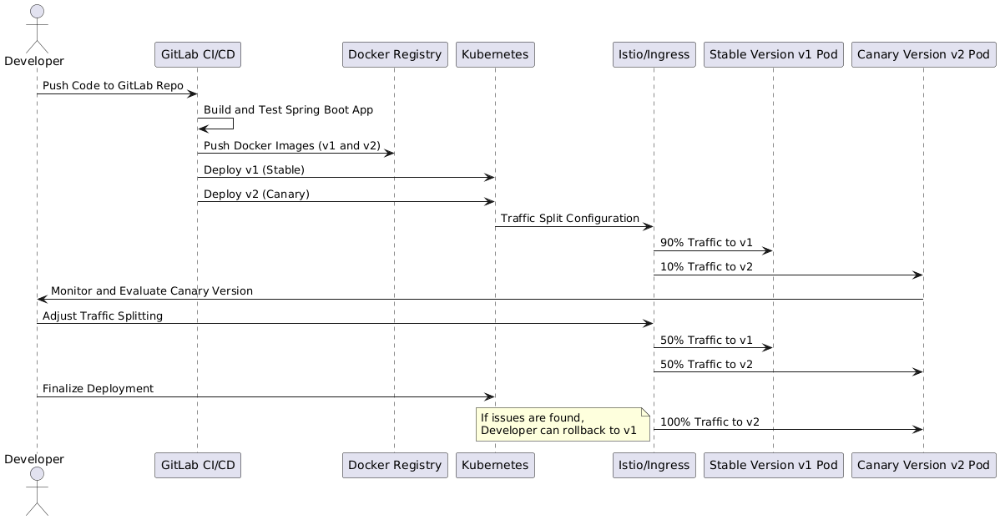

**Canary deployment** is a strategy used to roll out new versions of an application to a small subset of users first, while the majority of users continue to use the previous stable version. Once the new version proves to be stable, it is gradually rolled out to all users. In the context of a **Spring Boot application** running in a **Kubernetes** cluster, this process can be efficiently managed by using Kubernetes’ traffic control and pod management features.

&nbsp;



&nbsp;

- The developer pushes code changes to the GitLab repository.
- GitLab CI/CD automates the pipeline to build, test, and push Docker images to a registry.
- Kubernetes handles the deployment of the stable (v1) and canary (v2) versions.
- Traffic splitting is managed by Istio or Kubernetes Ingress.
- The developer monitors the new version and adjusts the traffic split before fully rolling out v2 or rolling back to v1 if issues occur.

&nbsp;

* * *

### **Key Components for Canary Deployment:**

1.  **Spring Boot Application**: A microservice or backend service built using Spring Boot.
2.  **Kubernetes Cluster**: An orchestration platform that manages containerized applications, automates deployment, scaling, and manages traffic.
3.  **Traffic Split/Control**: This can be done using Kubernetes' native tools like Ingress or service mesh technologies like Istio or Linkerd, which control how traffic is routed to different versions of the application.
4.  **Observability**: Monitoring tools such as Prometheus or Grafana are typically used to observe the behavior of the new version.

&nbsp;

* * *

### **How Canary Deployment Works in Kubernetes with Spring Boot**

1.  **Create and Deploy the Current Version (v1)**:
    
    - Your Spring Boot application is built, packaged, and containerized using **Docker**.
    - The current stable version (`v1`) is already running in the Kubernetes cluster.
    - This deployment may consist of multiple pods behind a Kubernetes **Service** that load-balances incoming traffic across the pods.
2.  **Build and Deploy the Canary Version (v2)**:
    
    - After developing a new version (`v2`) of the Spring Boot application, it is also containerized and pushed to the Docker registry.
    - You deploy this canary version (`v2`) alongside the existing stable version (`v1`), but only to a small number of pods (e.g., 1 pod with v2, while v1 still runs on 9 pods).
3.  **Configure Traffic Split**:
    
    - Traffic is directed to both versions based on a preconfigured percentage. For instance, you might send **90% of the traffic** to the stable version (`v1`) and **10% of the traffic** to the new version (`v2`).
    - This is handled by Kubernetes **Ingress controllers** or a **service mesh** like Istio, which provides advanced traffic management and can define routing rules.
4.  **Monitor the Canary Version**:
    
    - During the canary period, the behavior of the new version is closely monitored for issues such as increased error rates, slow performance, or other abnormalities.
    - Logs, metrics, and alerts (through tools like Prometheus, Grafana, or ELK) help ensure that v2 is functioning as expected.
5.  **Full Rollout or Rollback**:
    
    - If the canary version (v2) is stable and does not cause any issues, traffic is gradually shifted from v1 to v2. You can increase traffic to v2 in phases until 100% of the traffic is directed to it.
    - If issues are detected, you can easily rollback to v1 by routing all traffic back to the stable version, or simply removing the canary version (v2) pod.

&nbsp;

* * *

### **Configure Traffic Split**:

- Using Kubernetes **Ingress** or **Istio**, route a small percentage of the traffic to the v2 canary pods and the rest to the v1 stable pods.
- Example Istio VirtualService configuration to split traffic

```yaml
apiVersion: networking.istio.io/v1alpha3
kind: VirtualService
metadata:
  name: springboot
spec:
  hosts:
    - "springboot.mydomain.com"
  http:
    - route:
        - destination:
            host: springboot
            subset: v1
          weight: 90
        - destination:
            host: springboot
            subset: v2
          weight: 10

```

* * *

### **Advantages of Canary Deployment**

- **Reduced Risk**: Only a small percentage of users are affected if bugs are present.
- **Continuous Monitoring**: Provides feedback from real users in a production environment.
- **Easy Rollback**: Can roll back to the previous stable version quickly if issues arise.

&nbsp;

&nbsp;