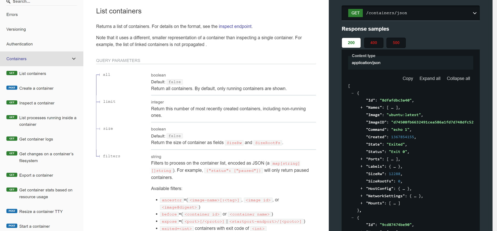

Docker uses a client-server architecture. The Docker client talks to the Docker daemon,

which does the heavy lifting of building, running, and distributing your Docker containers

The Docker client and daemon can run on the same system, or you can connect a Docker client to a remote Docker daemon.

The Docker client and daemon communicate using a REST API, over UNIX sockets or a network interface.

Another Docker client is Docker Compose, that lets you work with applications consisting of a set of containers.

### [The Docker daemon](https://docs.docker.com/get-started/overview/#the-docker-daemon)

&nbsp;

The Docker daemon (`dockerd`) listens for Docker API requests and manages Docker objects such as images, containers, networks, and volumes.

A daemon can also communicate with other daemons to manage Docker services.

&nbsp;

&nbsp;

### [The Docker client](https://docs.docker.com/get-started/overview/#the-docker-client)

&nbsp;

The Docker client (`docker`) is the primary way that many Docker users interact with Docker.

When you use commands such as `docker run`, the client sends these commands to `dockerd`, which carries them out. T

he `docker` command uses the Docker API. The Docker client can communicate with more than one daemon.

&nbsp;

&nbsp;

&nbsp;

### [Docker registries](https://docs.docker.com/get-started/overview/#docker-registries)

A Docker registry stores Docker images. Docker Hub is a public registry that anyone can use, and Docker looks for images on Docker Hub by default. You can even run your own private registry.

When you use the `docker pull` or `docker run` commands, Docker pulls the required images from your configured registry. When you use the `docker push` command, Docker pushes your image to your configured registry.

&nbsp;

&nbsp;

&nbsp;

Docker Engine openapi specs

[https://docs.docker.com/engine/api/v1.44/#tag/Container/operation/ContainerList](https://docs.docker.com/engine/api/v1.44/#tag/Container/operation/ContainerList "Docker Engine Api specs")

&nbsp;

e.g

&nbsp;

&nbsp;

&nbsp;

&nbsp;

&nbsp;

&nbsp;

&nbsp;

&nbsp;

&nbsp;