A Service resource makes Pods accessible to other Pods or users outside the cluster.

Without a Service, a Pod cannot be accessed at all.

A Service forwards requests to a set of Pods:

&nbsp;



&nbsp;

In this regard, a Service is akin to a load balancer.

Here is the definition of a Service that makes your Knote Pod accessible from outside the cluster:

```yaml
apiVersion: v1
kind: Service
metadata:
  name: knote
spec:
  selector:
    app: knote
  ports:
    - port: 80
      targetPort: 8080
  type: LoadBalancer
```

&nbsp;

&nbsp;

the service defination is recommended to save in same kubernetes yaml as deployment yaml,  
and separate the Service and Deployment resources with three dashes like this:

&nbsp;

```yaml
# ... Deployment YAML definition
---
# ... Service YAML definition
```

&nbsp;

&nbsp;

**The first part is the selector:**

&nbsp;

The first part is the selector:

```yaml
spec:
  selector:
    app: knote
```

&nbsp;

It selects the Pods to expose according to their labels.

In this case, all Pods that have a label of `app: knote` will be exposed by the Service.

Note how this label corresponds exactly to what you specified for the Pods in the Deployment resource:

```yaml
apiVersion: apps/v1
kind: Deployment
metadata:
  name: knote
spec:
  # ...
  template:
    metadata:
      labels:
        app: knote
```

&nbsp;

It is this label that ties your Service to your Deployment resource.

&nbsp;

* * *

The next important part is the port:

```yaml
spec:
  selector:
    app: knote
  ports:
    - port: 80
      targetPort: 8080
```

&nbsp;

In this case, the Service listens for requests on port 80 and forwards them to port 8080 of the target Pods.

&nbsp;

* * *

The last important part is the type of the Service:

```yaml
type: LoadBalancer
```

&nbsp;

In this case, the type is `LoadBalancer`, which makes the exposed Pods accessible from outside the cluster.

The default Service type is `ClusterIP`, which makes the exposed Pods only accessible from within the cluster.

&nbsp;

Beyond exposing your containers, a Service also ensures continuous availability for your app.

If one of the Pod crashes and is restarted, the Service makes sure not to route traffic to this container until it is ready again.

Also, when the Pod is restarted, and a new IP address is assigned, the Service automatically handles the update too.

&nbsp;

Furthermore, if you decide to scale your Deployment to 2, 3, 4, or 100 replicas, the Service keeps track of all of these Pods.