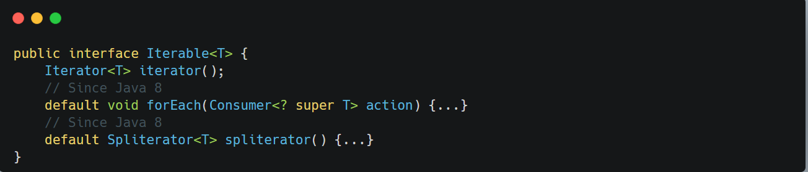

&nbsp;

The `Iterable` interface sits at the very root of the collection hierarchy. It defines just one abstract method `iterator()` that returns an Iterator over elements of type T.

The significance of `Iterable`:

- Enables the use of the enhanced for-loop (for-each)
- ==Allows collections to expose a way to iterate their elements without exposing internal structure==
- Since Java 8, provides default methods for functional-style iterations via `forEach()` and parallel iteration via `spliterator()`