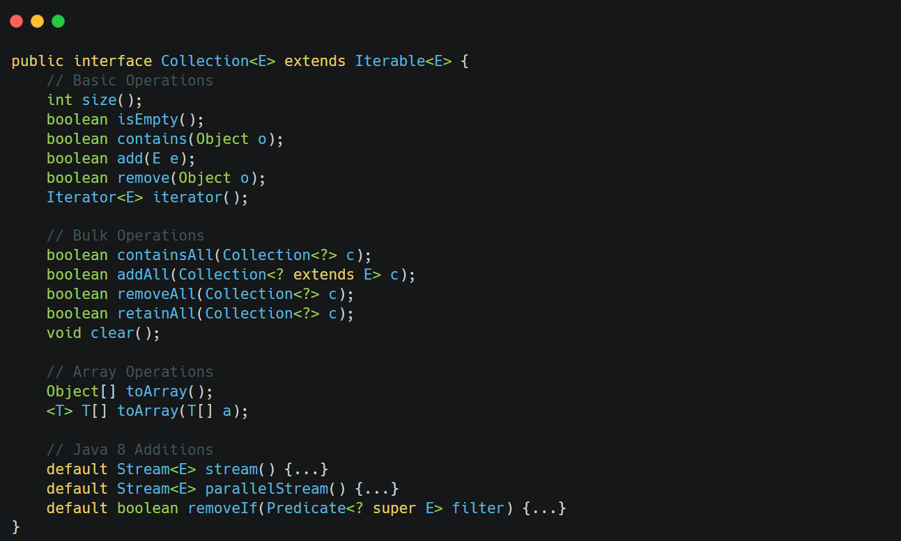

&nbsp;

&nbsp;

The `Collection` interface extends `Iterable` and represents a group of objects. This is the foundation for all collection implementations (except Maps, which follow a separate hierarchy).

Key aspects:

- Defines the core methods all collections must support
- Some operations are optional (may throw `UnsupportedOperationException`)
- Integrates with Java 8 Stream API through `stream()` and `parallelStream()`
- Supports bulk operations on entire collections
- Implementations must specify:
    - Thread safety guarantees
    - Whether null elements are allowed
    - Performance characteristics