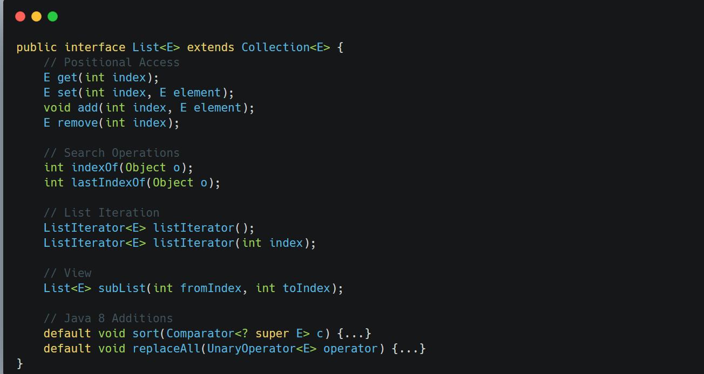

&nbsp;

`List` represents an ordered collection (also known as a sequence) ==that maintains insertion order and allows duplicates.==

Key characteristics:

- Indexed access (like arrays)
- Support for bidirectional traversal via `ListIterator`
- Allows positional insertion and removal
- Can create views of subranges via `subList()`
- Default sorting operation via `sort()`

&nbsp;

&nbsp;