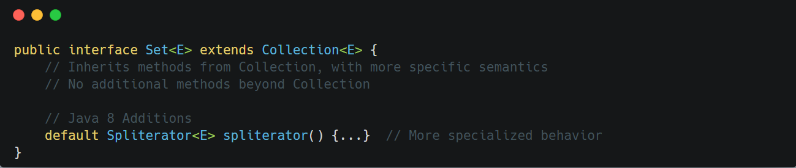

&nbsp;

`Set` represents a collection that contains no duplicate elements—based on `equals()` method.

Key characteristics:

- Enforces uniqueness constraint
- Some implementations provide ordering guarantees (LinkedHashSet, TreeSet)
- Mathematical set operations are modeled by methods inherited from Collection
- Implementations determine iteration order

&nbsp;

&nbsp;

&nbsp;