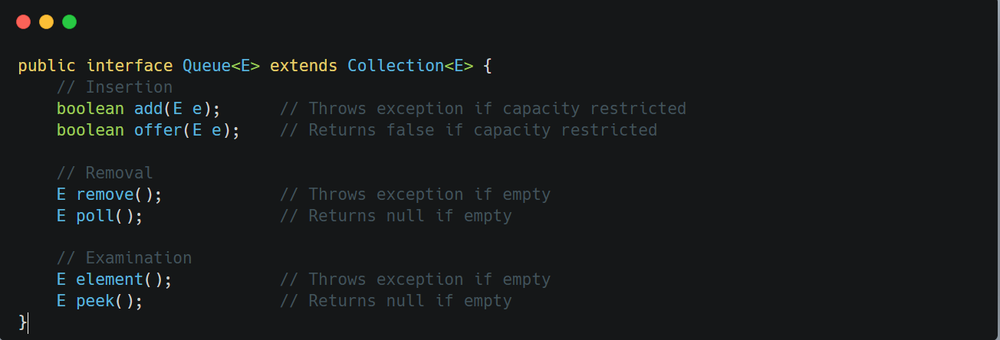

&nbsp;

`Queue` represents a collection designed for holding elements prior to processing, typically in FIFO order (first-in-first-out).

Key characteristics:

- Each operation exists in two forms:
    - Throws exception on failure
    - Returns special value on failure (null or false) (offer())
- Different implementations may provide:
    - Unbounded queues
    - Bounded queues
    - Priority ordering (via `PriorityQueue`)