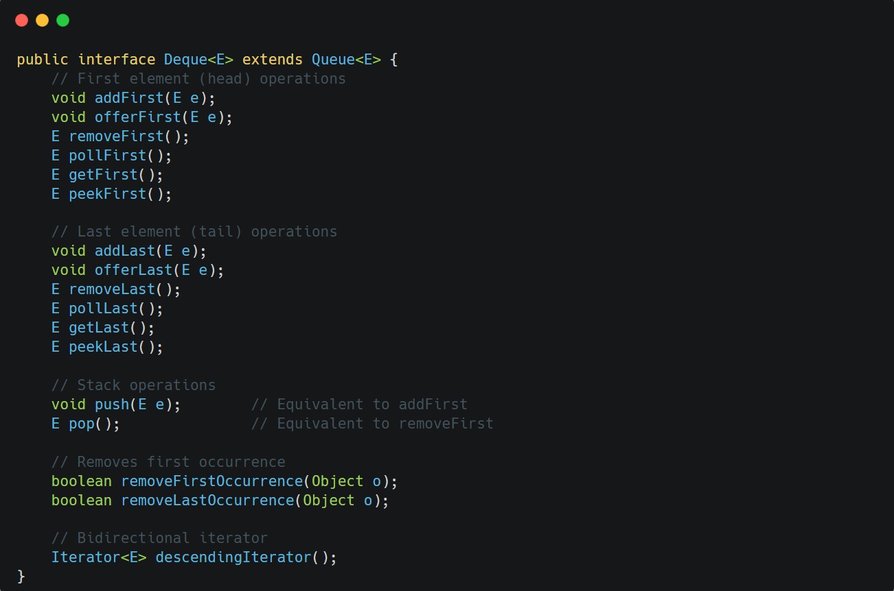

&nbsp;

`Deque` (pronounced "deck") stands for ==double-ended queue,== which supports insertion and removal at both ends.

Key characteristics:

- Can be used as both FIFO queues and LIFO stacks
- Provides methods to add, remove, and examine elements at both ends
- Offers methods compatible with `Stack` (push/pop)
- Supports bidirectional iteration