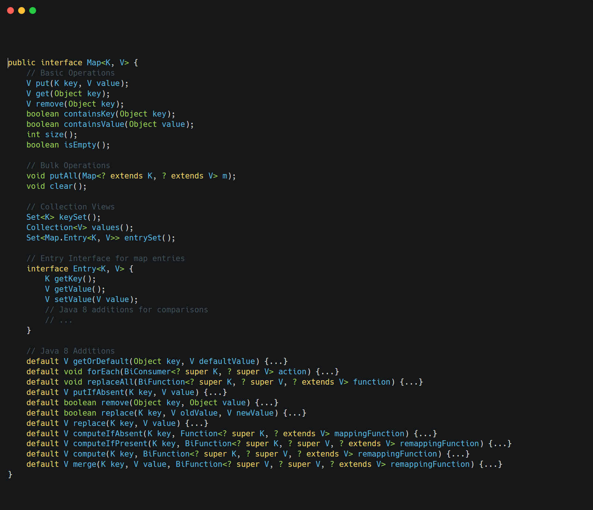

&nbsp;

&nbsp;

`Map` represents a mapping from keys to values with no duplicate keys allowed.

Key characteristics:

- Not a Collection (doesn't extend Collection interface)
- ==Three collection views: keys, values, and key-value pairs (entries)==
- Rich set of default methods in Java 8+ for common operations
- Implementations determine:
    - Key order (if any)
    - Key comparison method (equals() or compareTo())
    - Performance characteristics