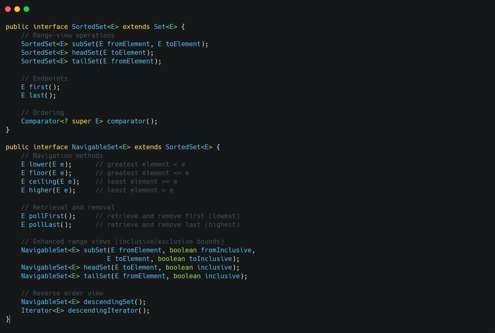

&nbsp;

&nbsp;

These interfaces extend `Set` to provide sorted collections.

`SortedSet` characteristics:

- Elements are ordered using natural ordering or a provided Comparator
- Provides methods for range views and endpoints

`NavigableSet` extends `SortedSet` with:

- Navigation methods to find closest matches
- Methods that poll from either end
- More flexible range-view operations with inclusive/exclusive options
- Descending views