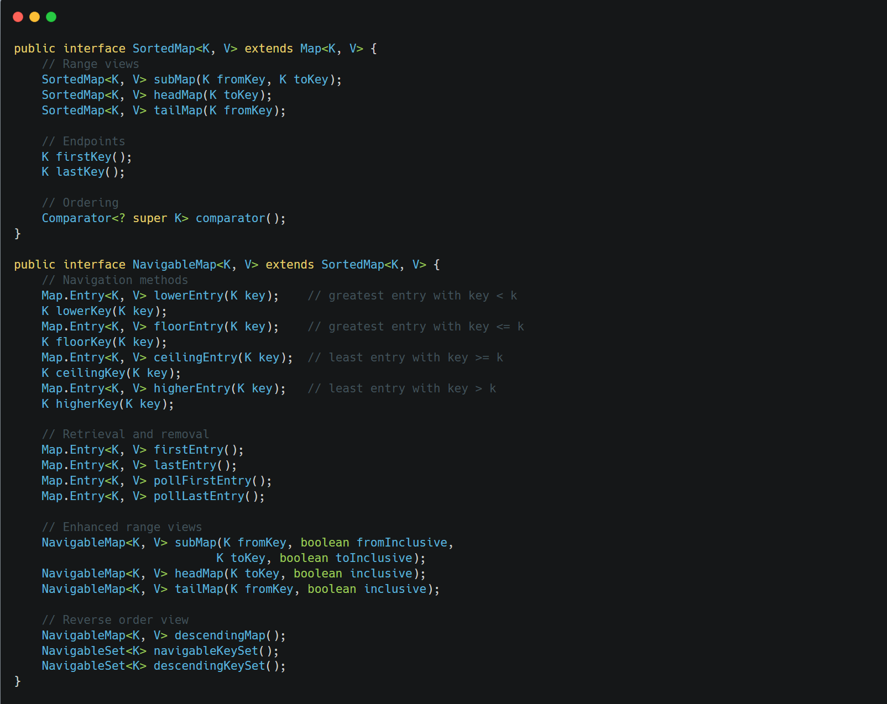

&nbsp;

&nbsp;

These interfaces extend `Map` to provide sorted mappings.

`SortedMap` characteristics:

- Keys are ordered using natural ordering or a provided Comparator
- Provides methods for range views and endpoints

`NavigableMap` extends `SortedMap` with:

- Rich navigation methods
- Operations that retrieve and remove entries
- Reverse order views
- More flexible range-view operations