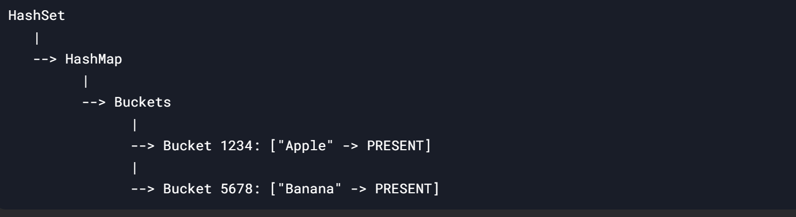

A `HashSet` in Java is built on top of a **HashMap**. This means that a `HashSet` uses a `HashMap` internally to store its elements. Here’s how it works:

* * *

### **1\. HashSet is Backed by a HashMap**

- When you create a `HashSet`, it internally creates a `HashMap`.
    
- In this `HashMap`, the **keys** are the elements of the `HashSet`, and the **values** are dummy objects (usually a single `Object` called `PRESENT`).
    
- This is why a `HashSet` ensures uniqueness: since `HashMap` keys are unique, the `HashSet` elements (which are the keys) are also unique
    

&nbsp;

&nbsp;

### **2\. Internal Structure**

Here’s what the internal structure of a `HashSet` looks like:

- **`map`**: This is the `HashMap` that stores the elements of the `HashSet`.
    
- **`PRESENT`**: A dummy object used as the value for all keys in the `HashMap`. Since we only care about the keys (the `HashSet` elements), the value is irrelevant.
    

&nbsp;

### **3\. How Elements Are Stored**

When you add an element to a `HashSet`, it is added as a **key** in the backing `HashMap`, with the value set to the dummy `PRESENT` object.

#### **Example: Adding an Element**

&nbsp;

`HashSet<String> set = new HashSet<>();`  
`set.add("Apple");`

&nbsp;

Internally, this translates to:

`map.put("Apple", PRESENT);`

- The key is `"Apple"`, and the value is `PRESENT`.
    
- If you try to add `"Apple"` again, the `HashMap` will detect that the key already exists and won’t add it again.
    

&nbsp;

### **4\. How Uniqueness is Ensured**

The `HashMap` ensures uniqueness by using the `hashCode()` and `equals()` methods of the keys (which are the `HashSet` elements).

&nbsp;

#### **Step-by-Step Process for Adding an Element:**

1.  **Calculate HashCode**:
    
    - The `hashCode()` method of the element is called to determine the bucket (location) in the `HashMap`.
        
    - Example: If `"Apple".hashCode()` returns `1234`, the element will go into bucket `1234`.
        
2.  **Check for Duplicates**:
    
    - If the bucket is empty, the element is added to the bucket.
        
    - If the bucket is not empty, the `equals()` method is used to compare the new element with all existing elements in the bucket.
        
        - If `equals()` returns `true` for any element, the new element is a duplicate and is **not added**.
            
        - If `equals()` returns `false` for all elements, the new element is added to the bucket.
            

