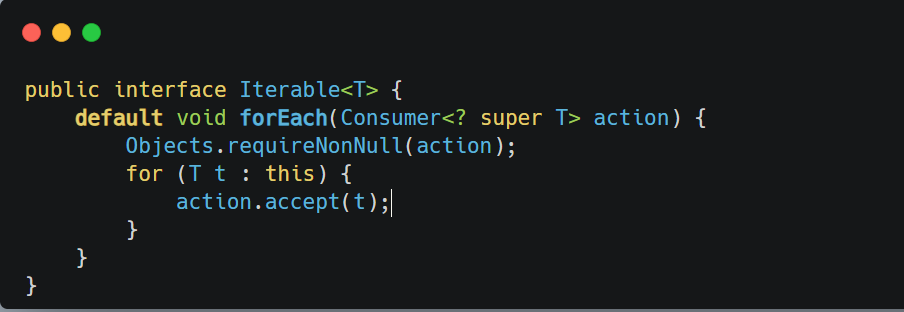
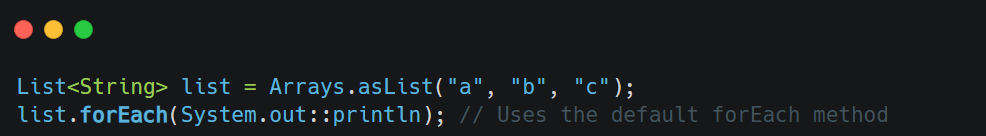

**TL;DR** :

- Default methods provide concrete implementations in interfaces.
- They enhance APIs without breaking existing code.
- Conflict resolution is required when multiple interfaces define the same method.
- Interfaces cannot maintain state; default methods are purely behavioral.
- Use default methods judiciously to avoid bloating interfaces.

&nbsp;

**Purpose** : To enhance interfaces with new methods without forcing implementing classes to provide implementations.

* * *

Default methods were introduced in **Java 8** to address the need for evolving interfaces without breaking existing implementations.

This feature allows interfaces to include concrete method implementations, enabling backward compatibility.

&nbsp;

### **How Default Methods Work**

1.  **Definition** :
    
    - A default method is defined in an interface using the `default` keyword.
    - It provides a concrete implementation that can be inherited by implementing classes.
2.  **Purpose** :
    
    - Enhance interfaces with new functionality without forcing all implementing classes to provide their own implementations.
    - Facilitate API evolution (e.g., adding new methods to widely used interfaces like `Collection`, `Map`, or `Iterable`).
3.  **Inheritance** :
    
    - If a class implements an interface with a default method, it inherits the method unless explicitly overridden.
    - If multiple interfaces define conflicting default methods, the implementing class must resolve the conflict.
4.  **Conflict Resolution** :
    
    - When a class implements multiple interfaces with the same default method signature, the class must override the method and explicitly call the desired implementation using `InterfaceName.super.method()`.
5.  **Interaction with Abstract Classes** :
    
    - Unlike abstract classes, interfaces cannot maintain state (no instance variables).
    - Default methods are purely behavioral enhancements and cannot store data.

&nbsp;

&nbsp;

&nbsp;

- The `forEach` method relies on the `iterator()` method, which is already implemented by `List`.
- Implementing classes don’t need to redefine `forEach` unless they want custom behavior.

&nbsp;

&nbsp;

&nbsp;