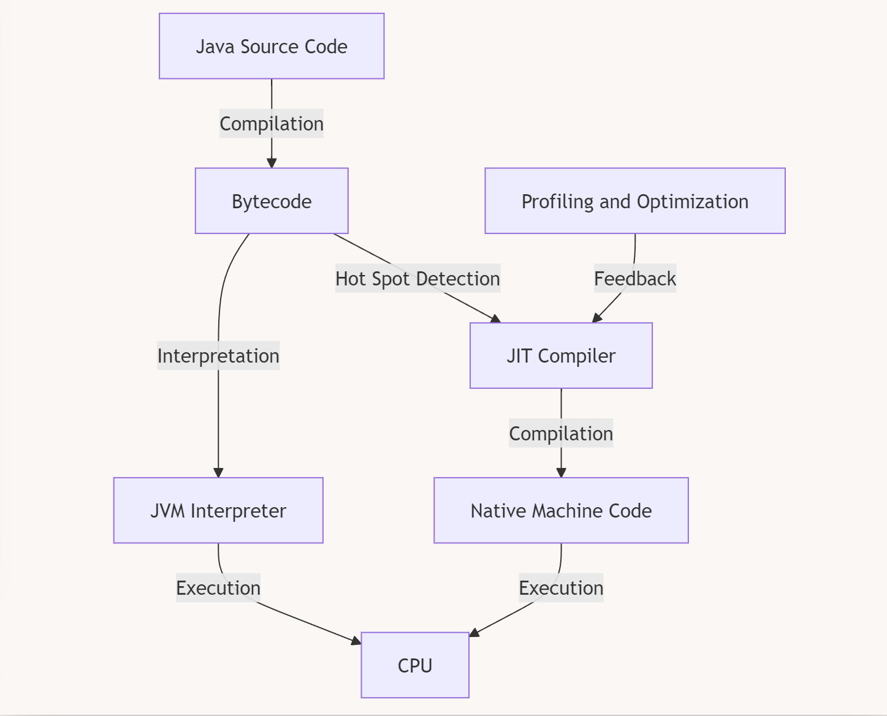

The JIT compiler is a ==**runtime optimization component**== of the Java Virtual Machine (JVM). When you write and compile Java code, it first gets converted into **bytecode**. This bytecode is platform-independent and is executed by the JVM.

&nbsp;

&nbsp;

1.  **Java Source Code**: Written by the developer.
2.  **Compilation**: The Java compiler compiles the source code into **bytecode**, which is platform-independent.
3.  **Interpretation (Initial Stage)**: The JVM’s **interpreter** reads the bytecode and executes it line by line.
    - At this stage, there’s **no native code** involved yet. The bytecode is interpreted directly by the JVM.
4.  **Hotspot Detection**: The JVM identifies **hot methods** (frequently called methods) during execution.
5.  **JIT Compilation (Optimization Stage)**: The **JIT compiler** converts the bytecode of these hot methods into **native machine code**.
6.  **Native Code Execution**: Once compiled into native machine code, the CPU executes this code **directly**, skipping interpretation for the hot methods.

&nbsp;

&nbsp;

&nbsp;

**Interpreter**:

- The interpreter reads the **bytecode** and executes it **line by line** or **instruction by instruction**.
- **No native machine code** is generated directly by the interpreter.
- This method is **slow** because every time an instruction is encountered, it must be interpreted, which introduces overhead. The bytecode is not converted into machine code but executed by the interpreter itself.

* * *

**JIT Compiler**:

- ==The **JIT compiler** steps in after the JVM detects that a method (or a piece of code) is being executed frequently. The JVM then marks this code as **hot** and sends it to the JIT compiler.==
- The JIT compiler **compiles** the bytecode into **native machine code** (specific to the operating system and CPU).
- Once a method is JIT-compiled, the native code is stored, and future calls to that method execute directly as native code, bypassing interpretation entirely.

&nbsp;

&nbsp;