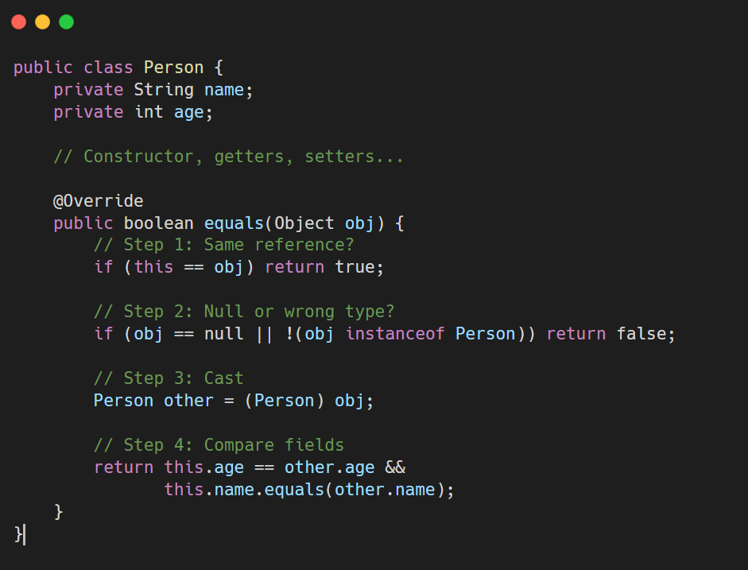
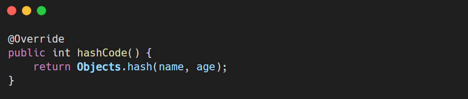
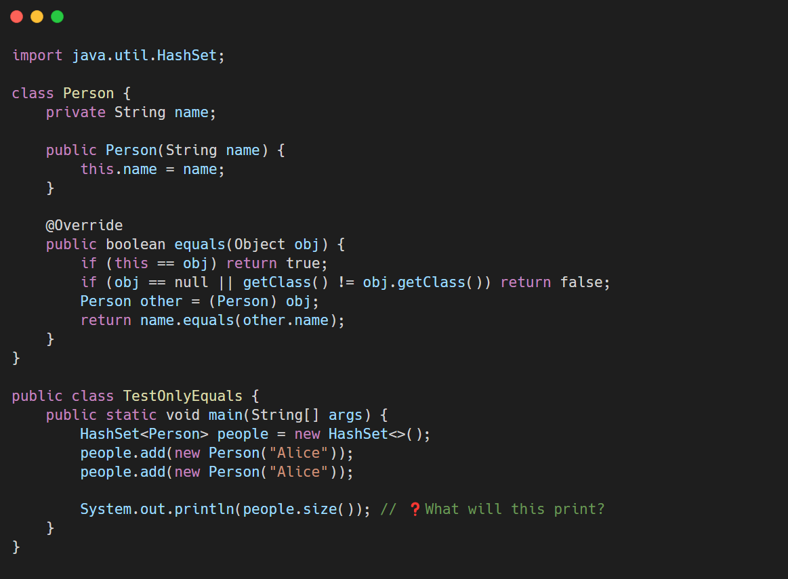
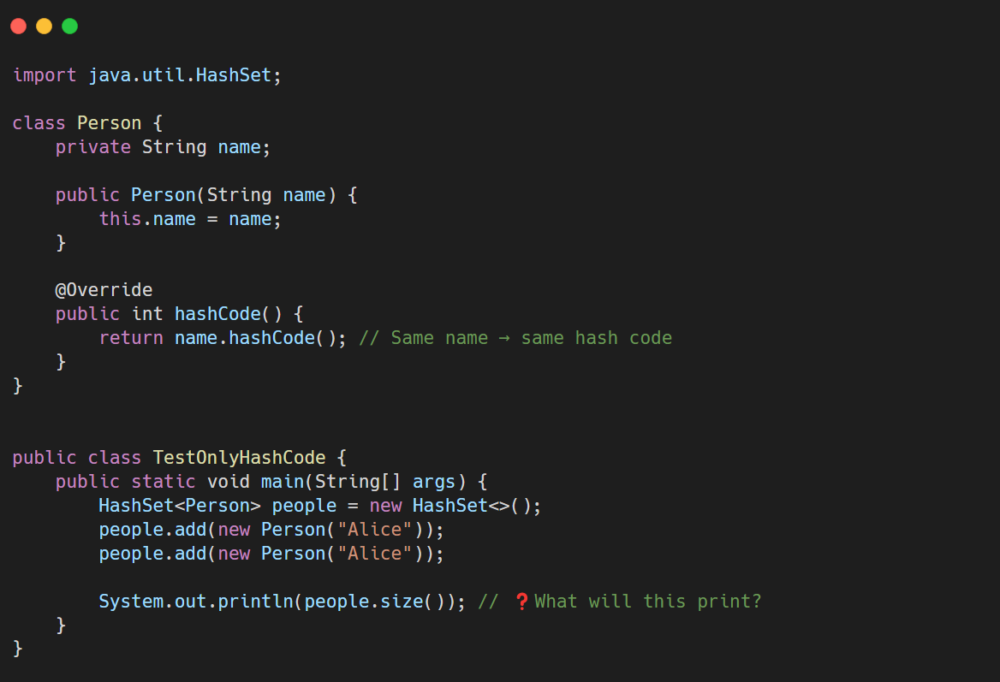

* * *

### 🧠 Key Concept: `hashCode()` and `equals()` Have Separate Roles

| Method | Purpose |
| --- | --- |
| `hashCode()` | Determines **which bucket** to store or look up an object in a hash-based collection    (like `HashSet`, `HashMap`) |
| `equals()` | Determines **if two objects are logically equal**(i.e., same content) |

&nbsp;

&nbsp;

* * *

**`hashCode()` is for location. `equals()` is for identity.**

You need both to work together to ensure logical equality in hash-based collections.

* * *

Java does this:

1.  **Step 1: Compute `hashCode()`**
    
    - Both objects have same name → same `hashCode()` (assuming we override it).
    - So both go into the **same bucket** .
2.  **Step 2: Within the bucket, call `equals()`**
    
    - Java checks if any object in the bucket is **equal** to the new one.
    - If `equals()` returns `true`, it treats it as a duplicate and **does not add** it.
    - If `equals()` returns `false` (or uses default implementation), it **adds** the new object.

&nbsp;

&nbsp;

* * *

## Why Override `equals()` and `hashCode()`?

By default:

- `equals()` compares **object references** (like `==`).
- `hashCode()` returns an integer based on object memory address.

&nbsp;

But if we need to compare two objects based on their contents e.g., two `Person` objects are equal if their names and ages match), we need to **override both methods.**

&nbsp;

## Implementing `equals()`

### Steps to implement:

1.  **Check if the passed object is the same instance (`this == obj`)**
2.  **Check if the object is of the correct type (`instanceof`)**
3.  **Cast it to your class**
4.  **Compare all relevant fields for equality**

&nbsp;

****

Implementation of hashCode()

notice this is Objects class not Object

****

&nbsp;

### Q: What happens if I override only `equals()` and not `hashCode()`?

&nbsp;

A: Two **equal objects** might have different hash codes → They will go into different buckets in a `HashMap` or `HashSet`. So even though they're equal, they won’t be treated as duplicates. 

Suppose I only override equals  
 

- Even though the two `Person("Alice")` objects are **equal** via `equals()`,
- They use the **default `hashCode()`** , which is based on memory address.  
    giving different hashcode based on memory address with default implementation
- So their hash codes are **different** , and they go into **different buckets** in the `HashSet`.

&nbsp;

* * *

&nbsp;

### Q: What if I override only `hashCode()`?

A: Objects may end up in the same bucket but `equals()` will say they’re different → inefficient hashing and confusion.

&nbsp;

We only override hashcode()

&nbsp;

- Both objects get the **same hash code** (`name.hashCode()`).
- So they go into the **same bucket** .
- But since you didn't override `equals()`, Java uses the **default `equals()`** (reference comparison).
- It sees them as **two different objects** (even though they have the same data), so it adds both.