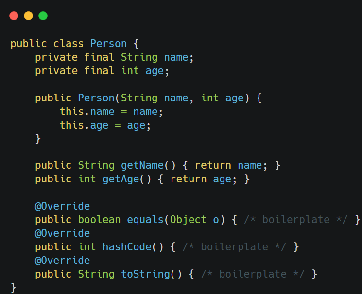
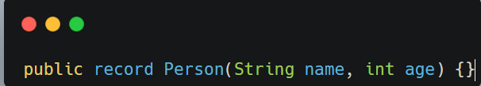
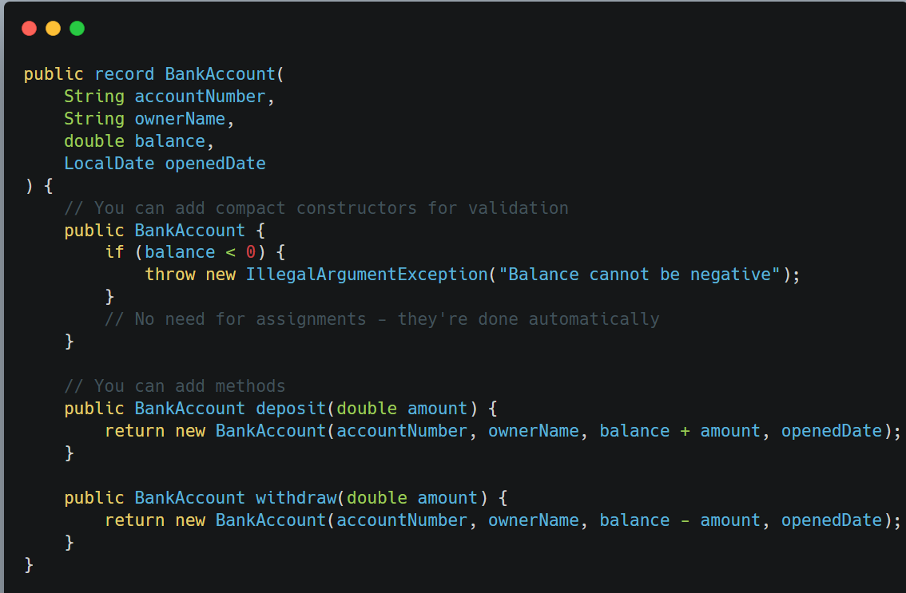
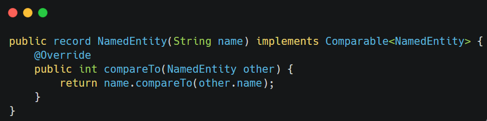

Records are a special kind of class that act as transparent carriers for immutable data. T==hey are essentially== ==**data-only classes** that automatically handle boilerplate code like constructors, getters, `equals()`, `hashCode()`, and `toString()`.==

&nbsp;

Here's a basic record example compared to a traditional class:

&nbsp;

### Equivalent Record

&nbsp;

we pass field similar to parameters,   
and inside the curly braces we can add other methods also

That's it! The record version gives us all the same functionality in one line.

## Key Features of Records

1.  **Implicitly final** - Cannot be extended
    
2.  **Implicitly immutable** - All fields are final
    
3.  **Auto-generated methods**:
    
    - Constructor
        
    - Accessor methods (getters)
        
    - `equals()`
        
    - `hashCode()`
        
    - `toString()`
        

&nbsp;

## When to Use Records

✅ **Perfect for**:

- Data transfer objects (DTOs)
    
- Value objects (like Money, DateRange, etc.)
    
- Return types from methods
    
- Compound map keys (since they implement proper equals/hashCode)
    
- Temporary data containers
    

&nbsp;

&nbsp;

## When NOT to Use Records

❌ **Avoid when**:

- You need mutable data
    
- You need to extend another class (records are final)
    
- You need to add significant behavior (methods that modify state)
    
- You need to hide implementation details (records are transparent)
    
- You need serialization with special handling
    
- You need complex construction logic (though compact constructors help)
    

&nbsp;

**Records can Implement Interfaces**:

