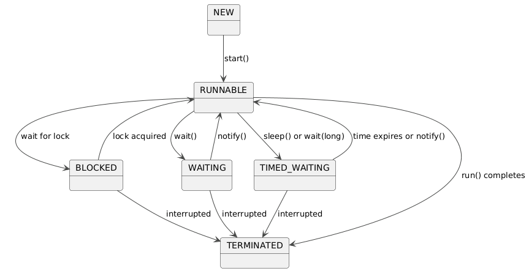

The thread lifecycle is managed by the JVM, with states defined in **Thread.State.**  
State is enum in Thread class defining the possible states of thread.  
Here’s a detailed breakdown:

- **New:** Thread is created but start() not called.  
    <br/>
- **Runnable:** Thread is ready to run or currently executing, scheduled by the JVM.  
    <br/>
- **Blocked:** Thread waits for a monitor lock (e.g., synchronized block held by another thread).  
    <br/>
- **Waiting:** Thread waits indefinitely for another thread (e.g., wait() without timeout).  
    <br/>
- **Timed Waiting:** Thread waits with a timeout (e.g., sleep(1000) or wait(1000)).  
    <br/>
- **Terminated:** Thread has completed execution or been interrupted.

&nbsp;

****

`NEW --> RUNNABLE : start()`: When you call `start()` on a new thread, it transitions to the `RUNNABLE` state.

&nbsp;

`RUNNABLE --> BLOCKED : wait for lock` If a thread tries to enter a synchronized block or method but the lock is held by another thread, it enters the `BLOCKED` state.

&nbsp;

`BLOCKED --> RUNNABLE : lock acquired`: Once the lock becomes available , the thread transitions back to the `RUNNABLE` state.

&nbsp;

`RUNNABLE --> WAITING : wait()`: Calling `wait()` on an object within a synchronized block or method causes the thread to release the lock and enter the `WAITING` state.

`WAITING --> RUNNABLE : notify()`: Another thread calling `notify()` or `notifyAll()` on the same object will wake up a waiting thread, transitioning it back to the `RUNNABLE` state.

&nbsp;

`RUNNABLE --> TIMED_WAITING : sleep() or wait(long)`: Calling `sleep(long)` or `wait(long)` causes the thread to enter the `TIMED_WAITING` state for the specified duration.

&nbsp;

`TIMED_WAITING --> RUNNABLE : time expires or notify()`: The thread transitions back to `RUNNABLE` when the time expires or when another thread calls `notify()` or `notifyAll()`.

&nbsp;

`RUNNABLE --> TERMINATED : run() completes`: When the `run()` method of a thread finishes execution, the thread transitions to the `TERMINATED` state.

&nbsp;

`WAITING --> TERMINATED : interrupted`: If a thread in the `WAITING` state is interrupted (by calling `interrupt()`), it will throw an `InterruptedException` and may transition to `TERMINATED`.

&nbsp;

`TIMED_WAITING --> TERMINATED : interrupted`: Same as above, but for threads in `TIMED_WAITING`.

&nbsp;

`BLOCKED --> TERMINATED : interrupted`: A thread in the blocked state can also be interrupted.

&nbsp;

* * *

```java
package com.pratik.thejavajourney.concurrency.printInorder.thread_creation;

public class ThreadStates {
    public static void main(String[] args) throws InterruptedException {
        Thread thread= new Thread(
                ()->{
                    try {
                        Thread.sleep(500);
                    } catch (InterruptedException e) {
                        throw new RuntimeException(e);
                    }
                }
        );
        System.out.println("state after thread creation "+thread.getState());
        thread.start();
        System.out.println("state after  thread is started "+thread.getState());
        Thread.sleep(100);
        System.out.println("State while running: " + thread.getState());
        //join() waits for thread to die
        thread.join();
        System.out.println("State after completion "+thread.getState());
    }
}

```

&nbsp;

output:

```bash
state after thread creation NEW
state after  thread is started RUNNABLE
State while running: TIMED_WAITING
State after completion TERMINATED
```

&nbsp;

The RUNNABLE state includes both ready-to-run and running, managed internally by the JVM, not directly observable in code.