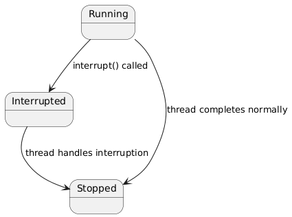

Thread interruption in Java is a cooperative mechanism for signaling a thread to stop its execution. It’s not a forceful termination but a request that the thread can choose to honor.

**Basic Mechanisms**:

- **interrupt():** Sets the interrupted status of the thread, which can be checked by the thread.
- **interrupted():** A static method that returns the interrupted status and clears it for the current thread.
- **isInterrupted():** Returns the interrupted status without clearing it, for any thread.

&nbsp;

**Usage Scenario**: Commonly used to stop long-running tasks, like a thread searching through a large dataset, if the user cancels the operation. The evidence leans toward interruption for graceful shutdowns, especially in server applications.

###  Interrupting a Task Thread

```java
package com.pratik.thejavajourney.concurrency.printInorder.thread_creation;

import lombok.SneakyThrows;

class TaskThread extends Thread{
    @Override
    public void run(){
        // the task thread runs in loop , sleeping for 1 second and then running again
        //print working everytime
        while (true){
            // task thread checks if it has been asked to stopped, this will be asked via interrupt() method
            if(Thread.interrupted()){
                System.out.println("Interrupt, stopping.");
                break;
            }
            try {
            // if the thead is interrupted while sleeping , it catches InterruptedException
            //print message and breaks the loop
                Thread.sleep(1000);
                System.out.println("Woking...");
            } catch (InterruptedException e) {
                System.out.println("caught interruption , stopping");
                break;
            }

        }
    }
}

//The main thread waits 5 seconds, calls interrupt() to request the task thread stop,
// and waits for it to finish with join().
public class ThreadInterruption {
    @SneakyThrows
    public static void main(String[] args) {
    TaskThread thread=new TaskThread();
    thread.start();
    // main thread sleep for 5 second before singalling task thead to stop through interrupt
    Thread.sleep(5000);
    thread.interrupt();
    // waits for thead to finish its execution
    thread.join();
    }
}

```

&nbsp;

```bash
o/p:

Woking...
Woking...
Woking...
Woking...
caught interruption , stopping

Process finished with exit code 0

```



&nbsp;

Interruption is cooperative, meaning the thread must check its status or handle InterruptedException. This is different from forceful termination, making it safer but requiring careful implementation.