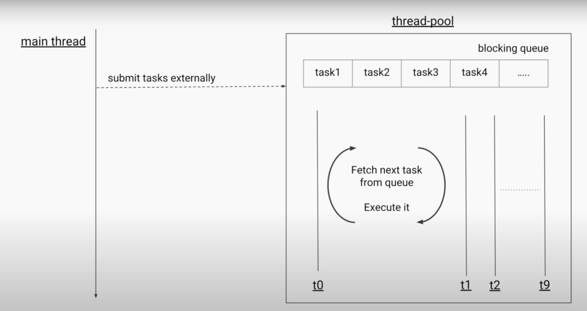

The Executor Framework is like a manager for your threads, making it easier to run tasks without manually creating threads. Thread pools are pre-created groups of threads that handle tasks, saving time and resources.

Instead of spawning threads yourself and managing their lifecycle, you hand off tasks to an executor service that handles all the thread management for you.

&nbsp;

We will use example of managing individual taxi  as manual thread creation and Executors as  running an entire taxi dispatch system.

&nbsp;

## The Core Components of the Executor Framework

The Executor framework gives us several key interfaces and classes:

1.  **Executor**: The simplest interface with just one method: `execute(Runnable)`
2.  **ExecutorService**: Extends Executor with additional lifecycle methods
3.  **ScheduledExecutorService**: Adds scheduling capabilities
4.  **Executors**: Factory class to create different types of executor services

  
<br/>ExecuterService uses data structure like blocking queue to store set of tasks, which are executed

by threads  
<br/>

## Creating Executor Services: The Factory Approach

Let's look at how to create different types of executor services using the `Executors` factory class:  
following are examples of creating   
<br/>

```java
import java.util.concurrent.ExecutorService;
import java.util.concurrent.Executors;
import java.util.concurrent.ScheduledExecutorService;
import java.util.concurrent.TimeUnit;

public class ExecutorDemo {
    public static void main(String[] args) {
        // Fixed thread pool - like having a set number of taxis always available
        ExecutorService fixedPool = Executors.newFixedThreadPool(4);
        
        // Cached thread pool - creates new threads as needed, reuses idle ones
        // Like a taxi service that scales up during rush hour
        ExecutorService cachedPool = Executors.newCachedThreadPool();
        
        // Single thread executor - processes tasks sequentially
        // Like having just one taxi that takes passengers one after another
        ExecutorService singleThread = Executors.newSingleThreadExecutor();
        
        // Scheduled executor - for delayed or periodic tasks
        // Like scheduling airport pickups in advance
        ScheduledExecutorService scheduler = Executors.newScheduledThreadPool(2);
        
        // Work stealing pool (Java 8+) - designed for recursive tasks
        // Like having taxis that can help each other when one area gets busy
        ExecutorService workStealing = Executors.newWorkStealingPool();
        
        // Don't forget to shut them down when done!
        fixedPool.shutdown();
        cachedPool.shutdown();
        singleThread.shutdown();
        scheduler.shutdown();
        workStealing.shutdown();
    }
}
```

&nbsp;

## Submitting Tasks to an Executor

There are three main ways to give work to an executor:

### 1\. execute() - Fire and Forget Tasks

Use this when you just need something done and don't care about the result:

```java
ExecutorService executor = Executors.newFixedThreadPool(2);

// Just run this, I don't need any result back
executor.execute(() -> {
    System.out.println("Executing task on thread: " + Thread.currentThread().getName());
    // Do some work...
});
```

&nbsp;

### 2\. submit() - Tasks That Return Results (Future)

When you need to get a result back eventually:

```java
// Submit returns a Future object that will eventually contain the result
Future<String> future = executor.submit(() -> {
    // Simulate work
    Thread.sleep(1000);
    return "Task completed by " + Thread.currentThread().getName();
});

// Do other work while the task is running...

// Get the result (this will block until the result is available)
try {
    String result = future.get();
    System.out.println("Got result: " + result);
} catch (Exception e) {
    e.printStackTrace();
```

### 3\. invokeAll() and invokeAny() - Batch Task Submission

For when you have multiple tasks to run:

```java
// Create a list of tasks
List<Callable<String>> tasks = Arrays.asList(
    () -> "Result from task 1",
    () -> "Result from task 2",
    () -> "Result from task 3"
);

// Run all tasks and get all results
List<Future<String>> results = executor.invokeAll(tasks);
for (Future<String> result : results) {
    System.out.println(result.get());
}

// OR - run all tasks and get just the first completed result
String firstResult = executor.invokeAny(tasks);
System.out.println("First completed: " + firstResult);
```

&nbsp;

## Shutting Down an Executor Service

Always shut down your executors when you're done:

```java
ExecutorService executor = Executors.newFixedThreadPool(4);

// Submit some tasks...

// Option 1: Graceful shutdown - wait for tasks to complete
executor.shutdown();
try {
    // Wait up to 5 seconds for tasks to complete
    if (!executor.awaitTermination(5, TimeUnit.SECONDS)) {
        // If we get here, tasks didn't finish in time
        System.out.println("Some tasks didn't finish in time");
    }
} catch (InterruptedException e) {
    Thread.currentThread().interrupt();
}

// Option 2: Immediate shutdown - cancel running tasks
List<Runnable> unfinishedTasks = executor.shutdownNow();
System.out.println("Cancelled " + unfinishedTasks.size() + " tasks");
```

&nbsp;

* * *

## Choosing the Right Executor Service

Here's a simple guide for picking the right executor:

1.  **Fixed Thread Pool**: Use when you have a specific number of tasks that can run in parallel, like the number of CPU cores for CPU-bound tasks.
    
    ```java
    // For CPU-bound tasks
    ExecutorService executor = Executors.newFixedThreadPool(
        Runtime.getRuntime().availableProcessors()
    );
    ```
    
2.  **Cached Thread Pool**: Good for many short-lived tasks, especially I/O-bound tasks that spend time waiting.
    
    ```java
    // For many I/O-bound tasks (network calls, file operations)
    ExecutorService executor = Executors.newCachedThreadPool();
    ```
    
3.  **Single Thread Executor**: When tasks must run sequentially, but in a background thread.
    
    ```java
    // For tasks that must happen one after another
    ExecutorService executor = Executors.newSingleThreadExecutor();
    ```
    
4.  **Scheduled Thread Pool**: For delayed or periodic tasks.
    
    ```java
    // For recurring maintenance tasks, timers, etc.
    ScheduledExecutorService executor = Executors.newScheduledThreadPool(2);
    ```
    
5.  **Work Stealing Pool**: For recursive or highly variable workloads.
    
    ```java
    // For fork/join tasks or variable workloads
    ExecutorService executor = Executors.newWorkStealingPool();
    ```
    

* * *

&nbsp;