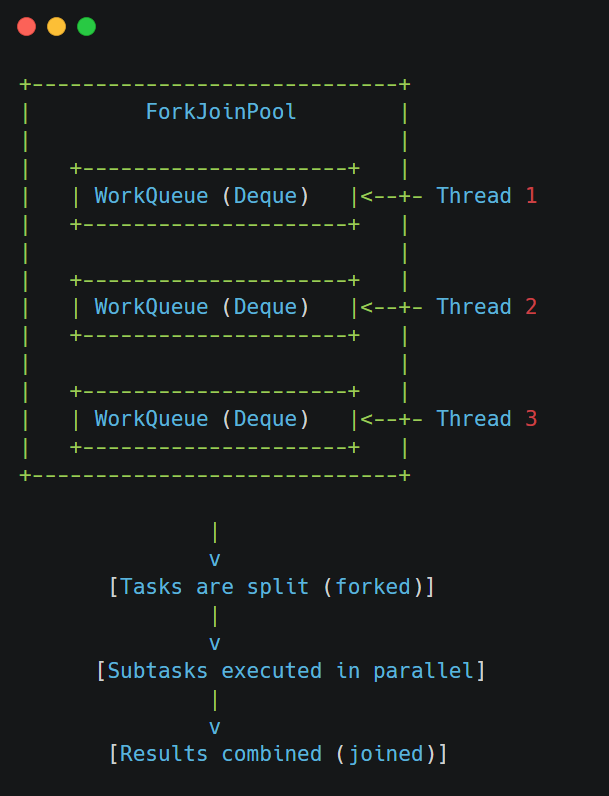

The **ForkJoinPool** in Java is a special type of thread pool introduced in Java 7 as part of the `java.util.concurrent` package.

&nbsp;

It's specifically designed to work efficiently with **divide-and-conquer algorithms**

&nbsp;

## What is ForkJoinPool?

At its core, **ForkJoinPool** manages a set of worker threads that execute **tasks** , which can **split themselves into smaller subtasks (fork)** and then **wait for the results of those subtasks (join)** .

&nbsp;

This model is ideal for **recursive problem-solving** where a large task can be divided into smaller chunks that can be processed independently.

&nbsp;

## Key Concepts

### 1\. **Fork**

- A task breaks itself into smaller subtasks.
- Each subtask can also fork again recursively.

### 2\. **Join**

- After forking, a task may call `join()` on each subtask to wait for its result.

### 3\. **Work-Stealing Algorithm**

- Worker threads in the ForkJoinPool use a **work-stealing algorithm** .
- If one thread runs out of tasks, it "steals" work from another thread’s **deque (double-ended queue)** .

&nbsp;

&nbsp;

&nbsp;

## imilarities Between ForkJoinPool and ExecutorService

### 1\. **Thread Pool Management**

Both `ForkJoinPool` and `ExecutorService` are built to **manage a pool of threads** that execute tasks concurrently. 

### 2\. **Asynchronous Task Execution**

They both support **asynchronous execution** of tasks using methods like:

- `submit()` – to submit a task for background execution.
- `execute()` – to run a task without expecting a result.

&nbsp;

&nbsp;

&nbsp;

## 🧩 Differences Between ForkJoinPool and ExecutorService

### 1\. **Core Design Philosophy**

- **ExecutorService** : Designed for general-purpose concurrency — handling independent tasks such as network calls, logging, background processing, etc.
- **ForkJoinPool** : Built specifically for **recursive divide-and-conquer algorithms** — where one big task splits into smaller subtasks recursively (think sorting, searching, matrix multiplication).

&nbsp;

### 2\. **Task Granularity and Structure**

- **ExecutorService** handles relatively **coarse-grained** , standalone tasks — each task usually runs independently and doesn’t break into subtasks.
- **ForkJoinPool** is optimized for **fine-grained** , recursive tasks — a single task forks itself into multiple subtasks, which may themselves fork again.

&nbsp;

### 3\. **Work Distribution Strategy**

- **ExecutorService** uses a **shared work queue** . All worker threads pull tasks from this central queue in FIFO (First In First Out) order. This can lead to contention and inefficiency when many small tasks are submitted.
    
- **ForkJoinPool** uses a **work-stealing algorithm** . Each thread has its own deque (double-ended queue). When a thread finishes its own tasks, it "steals" from other threads’ deques — typically from the end (LIFO), reducing contention.
    

&nbsp;

### 4\. **Task Types**

- **ExecutorService** works well with:
    
    - `Runnable` – for tasks with no return value.
    - `Callable<V>` – for tasks that return a value.
    
- **ForkJoinPool** is designed for:
    
    - `RecursiveTask<V>` – for tasks that return a result after forking and joining.  
         
    - `RecursiveAction` – for void-returning tasks. Both extend `ForkJoinTask<V>`, which is a special kind of task supporting `fork()` and `join()` semantics.

### 5\. **Use Case Example**

Let’s take the example of summing all elements in a very large array:

- With **ExecutorService** , you'd likely manually split the array into chunks, submit each chunk as separate `Callable<Integer>` tasks, collect all futures, and sum the results — a lot of boilerplate.
- With **ForkJoinPool** , you define a `RecursiveTask<Integer>`, and let it naturally **split itself** into halves until reaching a base case. Then, it **combines results** via `join()` — clean, recursive, and scalable.

&nbsp;

If you’re working on something like a web server handling client requests, `ExecutorService` is perfect. But if you’re implementing a fast  merge sort, or any recursive computation — go for `ForkJoinPool`.