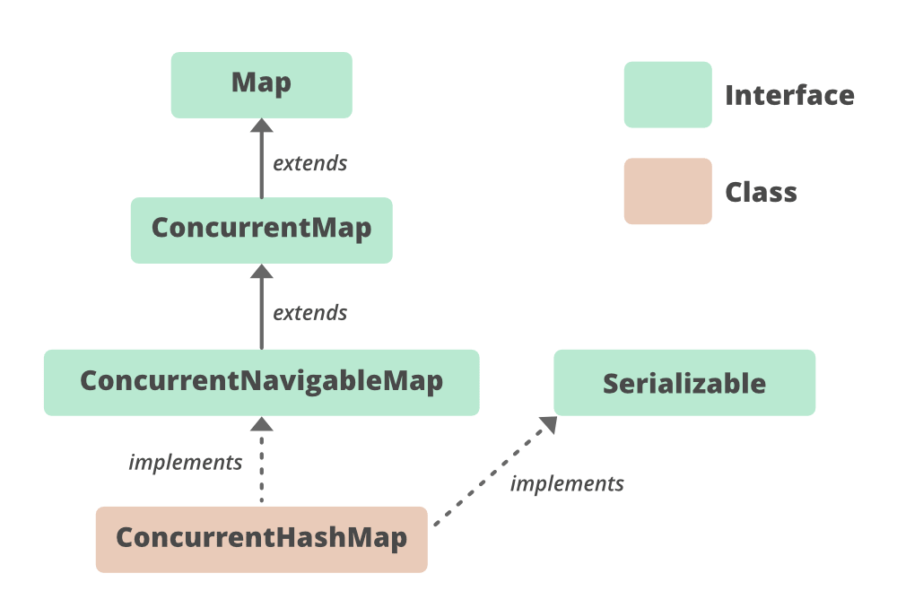

A standard `HashMap` is an array of **buckets** (often called `Node<K,V>[ ] table`).

- **Structure**:
    
    - A `HashMap` is backed by an array of **buckets** (`Node<K,V>[] table`).
        
    - Each bucket holds a **linked list** (or **tree** if collisions exceed a threshold).
        
    - The hash function maps keys to bucket indices.
        
- **Collision Handling**:
    
    - **Linked List**: If two keys hash to the same bucket, they are stored as a linked list.
        
        - **Problem**: In the worst case, search time is O(n).
    - **Tree** (Java 8+): If the linked list exceeds `TREEIFY_THRESHOLD` (default: 8), it converts to a **balanced tree** (`TreeBin`).
        
        - **Benefit**: Reduces search time to O(log n) in case of collisions.

```bash
Index 0: [Node1] → [Node2] → [Node3]  
Index 1: [Node4]  
...  
Index N: [TreeBin] (balanced tree of TreeNodes)  
```

### **Concurrency Challenges**

- **Problem with HashMap**:
    
    - Concurrent `put`/`get` operations can lead to **data corruption**.
        
        - Example: Two threads inserting into the same bucket → lost updates or infinite loops.
    - **Why**: No synchronization → race conditions.
        
- **Problem with Global Locks** (e.g., `Hashtable` or `Collections.synchronizedMap`):
    
    - A single lock is used for all operations (`put`, `get`, etc.).
        
    - **Consequence**: Threads block each other, even if they are working on different parts of the map.
        
    - **Result**: Poor scalability in high-concurrency scenarios.
        

* * *

### **3\. Java 8+ ConcurrentHashMap Design**

#### **Core Mechanics**

- **Bucket-Level Locking**:
    - **Lock Granularity**: Instead of locking the entire map or segments, lock **individual buckets**.
        
        - Each bucket is locked using `synchronized` on the **first node** of the bucket.
            
        - Threads accessing different buckets do **not block** each other.
            


- **Lock-Free Reads**:
    
    - **`get()` Operations**: No locks are used.
        
        - Uses **volatile reads** to ensure memory visibility.
    - **Why Safe?**: Writes (under locks) and `volatile` ensure that changes are visible to readers.
        
- **Tree Bins for Collisions**:
    
    - **TreeBin**: A balanced tree (Red-Black Tree) structure.
        
        - Used when a bucket exceeds `TREEIFY_THRESHOLD` (default: 8).
    - **Locking**: Uses **read-write locks** for concurrent access to tree nodes.
        
        - Multiple readers can access the tree simultaneously.
            
        - Writers acquire an exclusive lock.
            
- **Dynamic Resizing**:
    
    - **Trigger**: When the map exceeds `load factor * capacity`.
        
    - **Incremental Migration**:
        
        - A new table is created (double the size).
            
        - Threads help migrate old → new buckets incrementally (no global lock).
            
    - **ForwardingNode**: A marker node indicating a bucket is being migrated.
        
        - Threads encountering a `ForwardingNode` help with migration.

#### Java 8+ Workflow

  
  
<br/>

- **Thread 1**: Locks Bucket 3 → adds a node → unlocks.
    
- **Thread 2**: Reads Bucket 5 (no lock).
    
- **Thread 3**: Finds `ForwardingNode` → helps migrate Bucket 7.
    

* * *

### **Pre-Java 8 (Historical Context)**

- **Segment Locking**:
    
    - The map was divided into **16 segments** (default), each acting as a mini-HashMap.
        
    - Each segment had its own lock → 16 concurrent writers max.
        
- **Problems**:
    
    - Fixed segments → limited concurrency.
        
    - Uneven load distribution → some segments could be overloaded.
        
- **Why Java 8 Changed**:
    
    - Bucket-level locking → finer granularity.
        
    - Trees → resilience against collision attacks.
        

&nbsp;

* * *

&nbsp;

#### **Key Differences from HashMap**

| **Feature** | **HashMap** | **ConcurrentHashMap** |
| --- | --- | --- |
| **Thread Safety** | No  | Yes (bucket-level locks) |
| **Iterators** | Fail-fast | Weakly consistent |
| **Locking** | None | `synchronized` on bucket nodes |
| **Null Keys/Values** | Allowed | Disallowed |

&nbsp;

**Atomic Operations**  
<br/><br/>**we know** <span style="color: #88c0d0;">**computeIfAbsent() :**  
<br/></span>If the specified key is not already associated with a value, attempts to compute its value using the given mapping function and enters it into this map unless null.(so it will check if the key exist in map, if not it will compute its value based on provided function and then put it into the map)   
<br/>and this <span style="color: #88c0d0;">computeIfAbsent() is also present in HashMap also, <span style="color: #f8faff;">its just that concurrentHashMap provides atomic version of it.</span></span>  
<br/>

- **`computeIfAbsent(key, function)`**:
    
    - Atomically computes a value if absent. Ideal for caching.
        
        ```java
        map.computeIfAbsent("user:1001", k -> fetchFromDB(k));  
        ```
        
- **`merge(key, value, remappingFunction)`**:
    
    - Atomic updates (e.g., counters).
        
        ```java
        map.merge("counter", 1, Integer::sum);  
        ```
        
        here if map does not have key 'counter' it will put 1 as value, if it has that key it will take the value and add 1 to it using sum function provided.  
        so in this case it either put the provided value or recomputes it with existing and new provided value (here recompute function is sum so will add the values)
        
    
    &nbsp;
    

### **Performance Scenarios**

- **Best Case**:
    
    - Threads spread across buckets → **linear scalability**.
- **Worst Case**:
    
    - All threads hit the same bucket → **synchronized-like performance**.

&nbsp;

### **When to Use**

- **Write-heavy** concurrent scenarios (e.g., caches, counters).
    
- **Avoid**:
    
    - Read-heavy (use `CopyOnWriteArrayList`).
        
    - Requires strict consistency (use `Collections.synchronizedMap`).
        

&nbsp;

&nbsp;