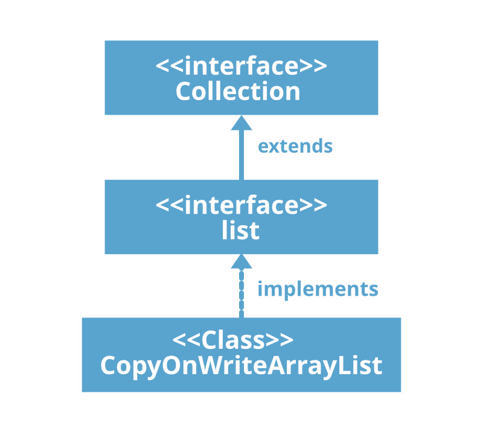

&nbsp;

&nbsp;

#### **1\. The Problem: Read-Heavy Workloads with Global Locks**

Imagine you’re building a **configuration manager** for a server.

- **100 threads** read the configuration every second.
    
- **1 thread** updates the configuration once a day.
    

If you use a `Collections.synchronizedList` (global lock):

- Every `get()` (read) must wait for the lock → 100 threads compete for the same lock.
    
- Even though writes are rare, **reads become slow** due to unnecessary contention.
    

**Question**: How can we allow **concurrent reads without locks** while ensuring writes are thread-safe?

&nbsp;

#### **2\. The Solution: Copy-On-Write (COW)**

**Core Idea**:

- **Reads**: No locks! Readers see an **immutable snapshot** of the data.
    
- **Writes**: Create a **new copy** of the data, modify it, and replace the old snapshot.
    

&nbsp;

<span style="color: #f8faff;">Java provides</span> `CopyOnWriteArrayList` <span style="color: #f8faff;">and</span> `CopyOnWriteArraySet`<span style="color: #f8faff;">.</span>

```java
CopyOnWriteArrayList<String> list
            = new CopyOnWriteArrayList<>();
```

Internal Mechanics:  
**1\. Initial State**<span style="color: #f8faff;">: Backed by a</span> `volatile Object[] array` <span style="color: #f8faff;">(immutable).</span>

<span style="color: #f8faff;">2.</span> **Read Operation** (e.g., `get(0)`):

- Directly access `elements[0]` → **no locks**.

**3\. Write Operation** (e.g., `add("D")`):

- **Acquire a lock** (to ensure only one writer at a time).
- **Copy** the current(old) array:
- **Modify** <span style="color: #f8faff;">the copy meaning writing existing element modification or writing new value   
    newElements<span style="color: #81a1c1;">\[</span><span style="color: #b48ead;">3</span><span style="color: #81a1c1;">\]</span> <span style="color: #81a1c1;">\=</span> <span style="color: #a3be8c;">"D"</span><span style="color: #81a1c1;">;</span>  
    </span>
- <span style="color: #f8faff;">**Replace** <span style="color: #f8faff;">the old array with the new one (volatile write)</span></span>

&nbsp;

&nbsp;



&nbsp;

**Key Insight**:

- **Readers** always see a **consistent snapshot** (the old or new array, never a half-modified state).
    
- **Writers** pay the cost of copying, but this is acceptable if writes are rare.
    

&nbsp;

#### **When to Use COW**

- **Read-heavy, write-rarely** scenarios:
    
    - Configuration data.
        
    - Listeners/observers (e.g., GUI event listeners).
        
    - Caches that rarely change.
        
- **Avoid** for:
    
    - Write-heavy workloads (e.g., real-time counters).
        
    - Large datasets (copying 1 MB array on every write is expensive).
        

&nbsp;

* * *

1.  **"What happens if a thread is iterating while another writes?"**
    
    - **Answer**: The iterator uses the **original snapshot** → it doesn’t see the new changes. This avoids `ConcurrentModificationException`.