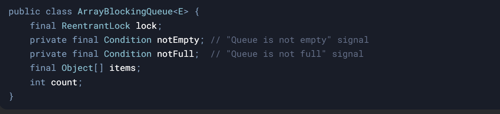

#### **1\. The Problem: Thread Coordination**

Imagine a **food delivery app**:

- **Producers**: Kitchen staff preparing orders.
    
- **Consumers**: Delivery drivers picking up orders.
    

**Challenges**:

1.  If the **order queue is empty**, drivers wait.
    
2.  If the **order queue is full**, kitchen staff wait.
    

How do we coordinate threads so they **wait efficiently** instead of busy-wasting CPU cycles?

&nbsp;

#### **2\. The Solution: BlockingQueue**

**Core Idea**:  
A thread-safe queue with **blocking operations**:

- **Producers**  are block if the queue is full.
    
- **Consumers** are block if the queue is empty.  
     
    

**Java Interface**: `BlockingQueue<E>`  
Key Implementations:

- `ArrayBlockingQueue`: Fixed-size, array-backed.
    
- `LinkedBlockingQueue`: Optionally bounded, linked-list nodes.
    
- `SynchronousQueue`: Direct handoff (no storage).
    

&nbsp;

##### **Key Methods**:

- **`put(E e)`**:
    
    - Inserts an element, **blocks** if the queue is full.
- **`take()`**:
    
    - Removes and returns an element, **blocks** if the queue is empty.
- **`offer(E e, long timeout, TimeUnit unit)`**:
    
    - Inserts an element, blocks for **up to a timeout** if full.
- **`poll(long timeout, TimeUnit unit)`**:
    
    - Removes an element, blocks for **up to a timeout** if empty.

&nbsp;

**Under the Hood**:

- Uses **locks** and **condition variables** (e.g., `ReentrantLock` and `Condition`).
    
- Example for `ArrayBlockingQueue`:
    

#### **When to Use BlockingQueue**

- **Producer-Consumer Patterns**:
    
    - Thread pools (e.g., `ThreadPoolExecutor` uses a `BlockingQueue` for tasks).
        
    - Data pipelines (e.g., processing logs from multiple sources).
        
- **Flow Control**:
    
    - Prevent resource exhaustion (e.g., using a bounded queue to limit memory usage).