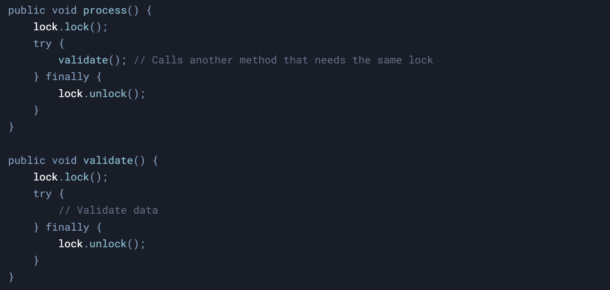

#### **1\. What Is Reentrancy?**

Reentrancy means that a thread can **acquire the same lock multiple times** without deadlocking itself.

Each time the thread acquires the lock, an internal counter is incremented. The lock is only released when the counter reaches zero.

#### **2\. Why Is Reentrancy Needed?**

Reentrancy is essential for **avoiding deadlocks** in scenarios where a thread needs to reacquire a lock it already holds. Without reentrancy, a thread would block itself, leading to a deadlock.

Meaning threadA goes and tries to reacquire lock it holds, but but it is already hold by same threadA itself and it wont be release unless its execution is complete which wont since it is needing lock again, this causes deadlock

#### **3\. Real-World Scenarios Where Reentrancy Matters**

##### **1: Recursive Methods**

Imagine a method that calls itself recursively and uses a lock to protect shared data:

- Without reentrancy, the thread would block itself on the second `lock.lock()` call.
    
- With reentrancy, the thread can proceed because it already holds the lock.
    

##### **2: Callbacks or Delegation**

A method might delegate work to another method that also requires the same lock:

&nbsp;

- Without reentrancy, the thread would block itself when calling `validate()`.
    
- With reentrancy, the thread can proceed because it already holds the lock.
    

* * *

#### **4\. How Reentrancy Works Internally**

- **Lock Counter**: Each lock maintains a counter to track how many times it has been acquired by the same thread.
    
- **Owner Thread**: The lock also tracks which thread currently holds it.
    
- **Unlocking**: The lock is only released when the counter reaches zero.
    

#### **5\. Why Is Reentrancy Important?**

1.  **Avoids Deadlocks**: Prevents a thread from blocking itself.
    
2.  **Simplifies Code**: Allows methods to call other methods that require the same lock without worrying about deadlocks.
    
3.  **Supports Recursion**: Enables recursive algorithms to work seamlessly with locks.
    

&nbsp;

* * *

#### **Reentrancy in Java Locks**

- **`synchronized`**: Reentrant by default.
    
- **`ReentrantLock`**: Explicitly reentrant.
    
- **`StampedLock`**: Non-reentrant (a thread cannot reacquire the same lock).
    

* * *

&nbsp;