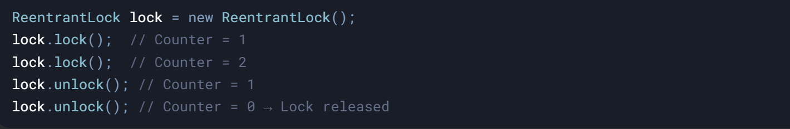
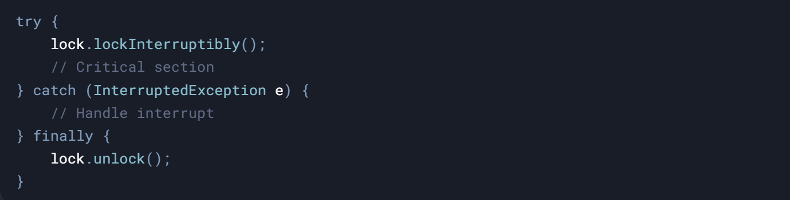
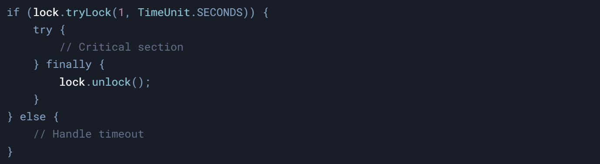

### **1\. ReentrantLock**

#### **What Problem Does It Solve?**

The `synchronized` keyword is simple but lacks flexibility. For example:

- If a thread is waiting for a lock, it **cannot be interrupted**.
    
- There’s **no way to specify a timeout** for acquiring a lock.
    
- There’s **no control over fairness** (which thread gets the lock next).
    

**ReentrantLock** addresses these limitations by providing:

- **Reentrancy**: A thread can acquire the same lock multiple times.
    
- **Fairness**: Ensures the longest-waiting thread gets the lock first.
    
- **Interruptible locks**: Threads can respond to interrupts while waiting.
    
- **Timeout support**: Threads can attempt to acquire a lock for a limited time.
    

&nbsp;

* * *

#### **How It Works**

1.  **Reentrancy**:
    
    - A thread can acquire the same lock multiple times.
        
    - Each `lock()` call increments a counter; each `unlock()` decrements it.
        
    - The lock is released only when the counter reaches zero.  
        <br/>
        



&nbsp;

**Fairness**:

- By default, `ReentrantLock` is unfair (no guarantee of order).
    
- Set fairness to `true` to ensure the longest-waiting thread gets the lock.
    


**Interruptible Locks**:

- Use `lockInterruptibly()` to allow a thread to respond to interrupts while waiting.



&nbsp;

**Timeout Support**:

- Use `tryLock(timeout)` to attempt acquiring the lock for a limited time.



&nbsp;

#### **Comparison with `synchronized`**

| **Feature** | **synchronized** | **ReentrantLock** |
| --- | --- | --- |
| **Reentrancy** | Yes | Yes |
| **Fairness** | No  | Configurable |
| **Timeout Support** | No  | `tryLock(timeout)` |
| **Interruptible** | No (blocks indefinitely) | `lockInterruptibly()` |
| **Code Flexibility** | Limited (block-scoped) | Explicit `lock()`/`unlock()` |

* * *

#### **When to Use ReentrantLock**

- **Fine-grained control**: When you need fairness, timeouts, or interruptible locks.
    
- **Complex locking logic**: When `synchronized` blocks are not sufficient.
    

&nbsp;

* * *

#### **How `Condition` Works with `ReentrantLock`**

- A `ReentrantLock` can have **multiple `Condition` objects**.
    
- Each `Condition` represents a separate wait set.
    
- Threads can wait on a specific condition and be signaled independently.
    

&nbsp;

**Key Methods**:

- `await()`: Releases the lock and waits for a signal.
    
- `signal()`: Wakes up one waiting thread.
    
- `signalAll()`: Wakes up all waiting threads.
    

&nbsp;

&nbsp;

```java
package com.pratik.thejavajourney.concurrency.printInorder;

import java.util.ArrayList;
import java.util.List;
import java.util.concurrent.locks.Condition;
import java.util.concurrent.locks.ReentrantLock;

class ProducerConsumer {
    private final ReentrantLock lock = new ReentrantLock();
    private final Condition full = lock.newCondition();
    private final Condition empty = lock.newCondition();
    private final List<Integer> buffer = new ArrayList<>();
    private final int BUFFER_INITIAL_CAPACITY = 5;

    public void produce(int item) throws InterruptedException {
        lock.lock();
        try {
            while (buffer.size() == BUFFER_INITIAL_CAPACITY) {
                System.out.println("buffer is full");
                full.await();
            }

            //if not full produce

            buffer.add(item);
            System.out.println("Produced " + item);
            empty.signal();
        } finally {
            lock.unlock();
        }

    }

    public void consume() throws InterruptedException {
        lock.lock();
        try {
            while (buffer.size() == 0) {
                System.out.println("buffer is empty nothing to consume");
                //wait on condition empty
                empty.await();
            }
            Integer item = buffer.remove(0);
            System.out.println("consumed item from buffer "+item);
            full.signal();
        } finally {
            lock.unlock();
        }

    }

    public static void main(String[] args) {
        ProducerConsumer pc = new ProducerConsumer();
        Thread producer = new Thread(() -> {
            try {
                for (int i = 1; i <= 10; i++) {
                    pc.produce(i);
                    Thread.sleep(500); // Simulate production time
                }
            } catch (InterruptedException e) {
                e.printStackTrace();
            }
        });

        // Consumer thread
        Thread consumer = new Thread(() -> {
            try {
                for (int i = 1; i <= 10; i++) {
                    pc.consume();
                    Thread.sleep(1000); // Simulate consumption time
                }
            } catch (InterruptedException e) {
                e.printStackTrace();
            }
        });

        // Start threads
        producer.start();
        consumer.start();
    }
}


```

&nbsp;

#### **4\. How It Works**

1.  **Producers**:
    
    - If the buffer is full, they wait on `full`.
        
    - After adding an item, they signal `empty` to wake up consumers.
        
2.  **Consumers**:
    
    - If the buffer is empty, they wait on `empty`.
        
    - After removing an item, they signal `full` to wake up producers.