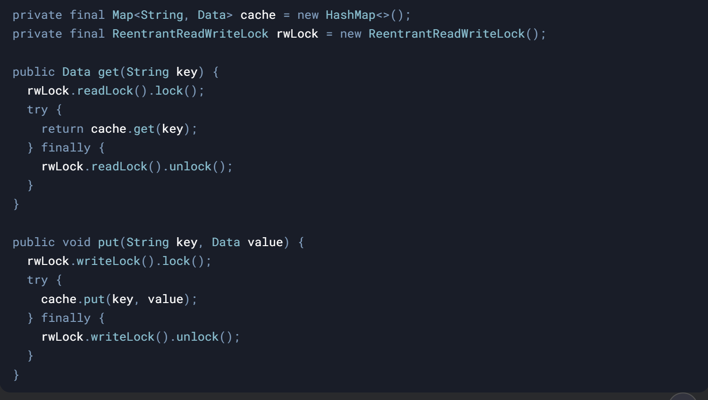

#### **What Problem Does It Solve?**

In **read-heavy scenarios**, using a single lock (like `synchronized` or `ReentrantLock`) forces all threads to wait, even if they’re only reading. This is inefficient.

&nbsp;

**ReadWriteLock** solves this by providing two locks read and write lock:

- Allowing **multiple threads to read concurrently**.
    
- Ensuring **only one thread can write at a time**.
    

&nbsp;

&nbsp;

#### **How It Works**

1.  1.  **Two Locks in One**:
        
        - **Read Lock**: Shared, non-exclusive. Multiple threads can hold it simultaneously.
            
        - **Write Lock**: Exclusive. Only one thread can hold it, and it blocks all reads/writes
            
    
    
    
2.  **Reentrancy**:
    
    - A thread can acquire the same read/write lock multiple times.
3.  **Lock Downgrading**:
    
    - A thread holding a write lock can acquire a read lock (useful for atomic writes followed by reads)

#### **Example: Read-Heavy Cache**

****

#### **Pitfalls**

- **Writer Starvation**: If reads are constant, writers may wait indefinitely.
    
- **No Upgrade from Read to Write Lock**: Attempting this causes deadlock.
    

&nbsp;