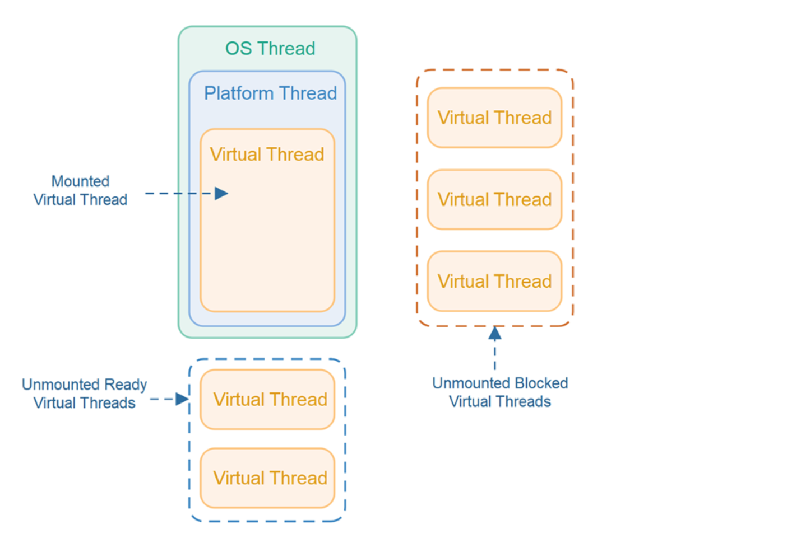

### **Understanding the Layers: OS Threads, Platform Threads, and Virtual Threads**

&nbsp;

#### **OS Threads**

- **What They Are**: Threads managed directly by the operating system (OS).
    
- **Characteristics**:
    
    - Heavyweight (each thread consumes ~1 MB of memory).
        
    - Limited by OS constraints (e.g., max threads per process).
        
    - Expensive to create and context-switch.
        

&nbsp;

#### **Platform Threads**

- **What They Are**: Java’s representation of OS threads.
    
    - In Java, every `java.lang.Thread` is a **platform thread** by default.
- **Characteristics**:
    
    - 1:1 mapping with OS threads.
        
    - Same limitations as OS threads (memory, scalability).
        

&nbsp;

#### **Virtual Threads**

- **What They Are**: Lightweight threads managed entirely by the JVM.
    
- **Characteristics**:
    
    - No direct mapping to OS threads.
        
    - Thousands can fit in 1 MB of memory.
        
    - Cheap to create and context-switch.
        

&nbsp;

&nbsp;

* * *

### **How Virtual Threads Work Under the Hood**

#### **Carrier Threads**

- Virtual threads run on a small pool of **platform threads** (called **carrier threads**).
    
- The JVM schedules virtual threads onto these carrier threads.
    

#### **Continuations**

- When a virtual thread blocks (e.g., waiting for I/O), the JVM **pauses** it and switches to another virtual thread. meaning it **mounts another thread**
    
- No OS involvement → no context-switching overhead.
    

#### **Scheduler**

- JVM-managed, work-stealing FIFO scheduler.

&nbsp;

- **Q**: What are virtual threads?
    
    - **A**: Lightweight, JVM-managed threads for high-throughput concurrent tasks.
- **Q**: How do they differ from platform threads?
    
    - **A**: Virtual threads are cheap (1KB vs 1MB), managed by JVM, and scale to millions.
- **Q**: When *not* to use virtual threads?
    
    - **A**: CPU-bound tasks (no benefit). Use platform threads or `ForkJoinPool`.
- **Q**: Can virtual threads replace reactive programming?
    
    - **A**: Yes for blocking I/O. No for non-blocking (e.g., `CompletableFuture` still has uses).

&nbsp;

* * *

### **What Is Blocking, and How Do Virtual Threads Handle It?**

#### **Blocking Operations**

- **Definition**: When a thread waits for a resource (e.g., I/O, database, network).
    
- **Examples**:
    
    - Reading from a file.
        
    - Waiting for a database query to complete.
        
    - Sleeping (`Thread.sleep()`).
        

#### **How Platform Threads Handle Blocking**

- The thread is **paused** by the OS.
    
- The CPU switches to another thread (expensive context switch).
    
- Limited by the number of OS threads.
    

#### **How Virtual Threads Handle Blocking**

- The JVM **pauses** the virtual thread (no OS involvement).
    
- The CPU switches to another virtual thread (cheap context switch).
    
- Millions of virtual threads can block without wasting resources.
    

&nbsp;

* * *

### **Use Cases for Virtual Threads**

#### **1\. High-Throughput Servers**

- **Example**: A web server handling 100,000+ concurrent HTTP requests.
    
- **Why Virtual Threads?**:
    
    - Each request can run in its own virtual thread.
        
    - Blocking I/O (e.g., database calls) doesn’t waste resources.
        

#### **2\. Blocking I/O Operations**

- **Example**: Reading/writing files, making network requests.
    
- **Why Virtual Threads?**:
    
    - Write synchronous code that scales like asynchronous code.

#### **3\. Legacy Code Modernization**

- **Example**: Refactoring old code that uses thread pools.
    
- **Why Virtual Threads?**:
    
    - Replace thread pools with virtual threads for instant scalability.

* * *

&nbsp;

### **When *Not* to Use Virtual Threads**

#### **CPU-Bound Tasks**

- **Example**: Complex calculations, image processing.
    
- **Why Not?**:
    
    - Virtual threads don’t improve performance for CPU-bound tasks.
        
    - Use platform threads or `ForkJoinPool` instead.
        

#### **Non-Blocking I/O**

- **Example**: Reactive streams, `CompletableFuture`.
    
- **Why Not?**:
    
    - Virtual threads are designed for blocking I/O.
        
    - Non-blocking I/O still has its place for advanced use cases.