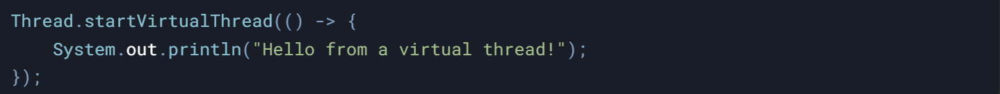
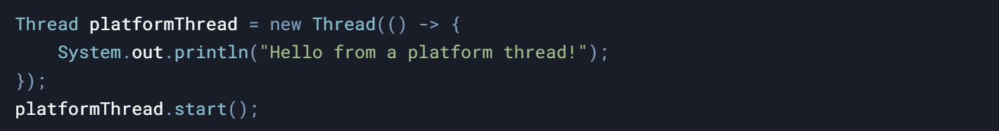
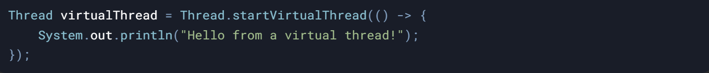
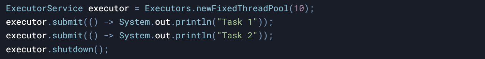
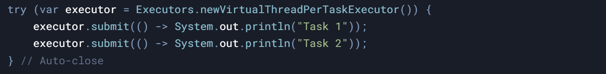
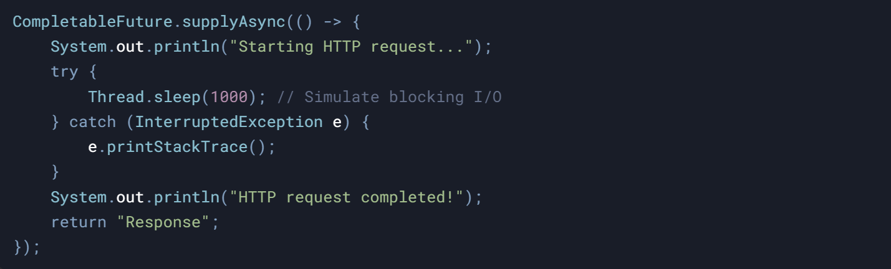
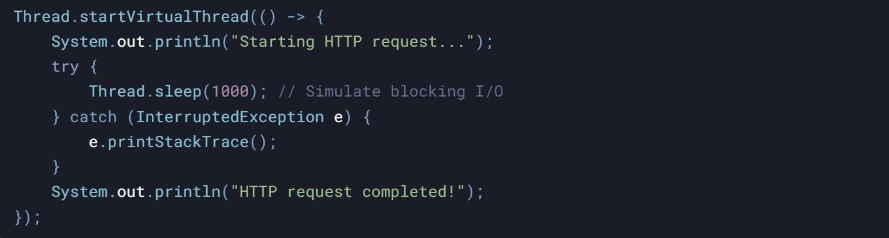

### **Creating Virtual Threads**

#### **Starting a Virtual Thread**

- Use `Thread.startVirtualThread()` to create and start a virtual thread.  
     

- Virtual threads are **lightweight** and cheap to create.
    
- You can create **millions** of virtual threads without running out of memory.
    

&nbsp;

#### Differences from Platform Threads:

  
**Platform Thread**:

Platform threads map to OS threads (heavyweight).

****

&nbsp;

**Virtual Thread**:  
Virtual threads are managed by the JVM (lightweight). here it is creating single virtual thread:

* * *

&nbsp;

### **Using Executors with Virtual Threads**

#### **Traditional Thread Pool**

- Example using `Executors.newFixedThreadPool()`:

- Limited by the number of threads in the pool.
    
- Blocking tasks can waste resources.
    

&nbsp;

#### **Virtual Thread Per Task Executor**

- Example using `Executors.newVirtualThreadPerTaskExecutor()`:

- Each task which we are submitting to the executor runs in its own virtual thread.  
    since we are using newVirtual**ThreadPerTask**Executor it will create new virtual thread per task
    
- No need to worry about thread pool size or blocking tasks.
    

&nbsp;

### Blocking Operations with Virtual Threads

- Virtual threads handle blocking operations efficiently.
- The JVM pauses the virtual thread during blocking and switches to another task.
    - meaning JVM dismounts the virtual thread from carrier thread and mounts ready virtual threads

#### **Blocking I/O Example**

- Simulate a blocking operation (e.g., HTTP request):

&nbsp;

* * *

&nbsp;

#### **Comparison with Reactive Programming**

- **Reactive Code**:  
    
- **Virtual Thread Code**:  
    

&nbsp;

**Virtual threads provide normal stack traces, making debugging easier than reactive code.**

&nbsp;

&nbsp;

&nbsp;