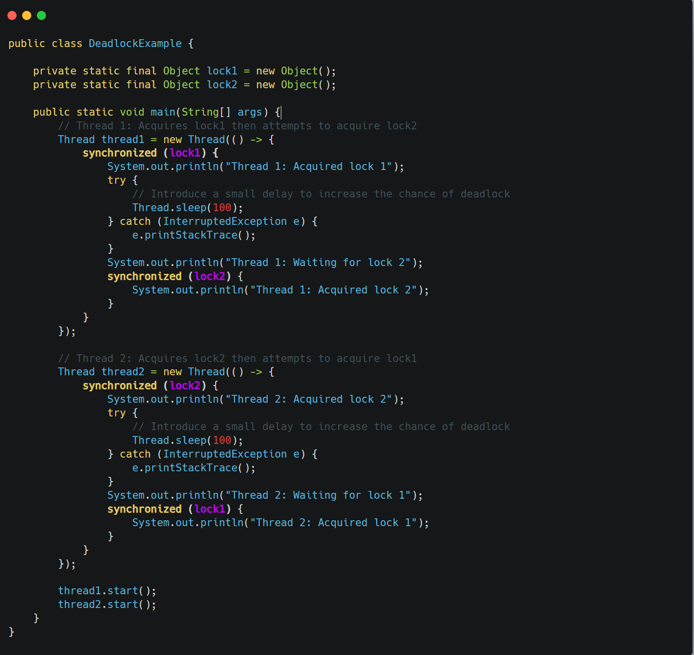

&nbsp;

Deadlock is a situation in concurrent programming where two or more threads are blocked forever, waiting for each other. The four necessary conditions for a deadlock to occur are:  
(all 4 are necessary) 

- **Mutual Exclusion:** Resources involved are non-sharable; only one thread can use a resource at a time.
- **Hold and Wait:** A thread holds at least one resource and is waiting for another resource held by another thread.
- **No Preemption:** Resources cannot be forcibly taken from a thread; they must be released voluntarily.
- **Circular Wait:** A set of threads are waiting for each other in a circular fashion (Thread A waits for a resource held by Thread B, Thread B waits for a resource held by Thread C, and Thread C waits for a resource held by Thread A).

&nbsp;

&nbsp;

&nbsp;

&nbsp;

The deadlock occurs if:

1.  `thread1` acquires `lock1`.
2.  `thread2` acquires `lock2`.
3.  Now, `thread1` needs `lock2` (held by `thread2`), and `thread2` needs `lock1` (held by `thread1`). Both threads are blocked indefinitely, waiting for the other to release the lock they need. The `Thread.sleep(100)` calls are added to increase the likelihood of this specific interleaving of operations, making the deadlock more probable.