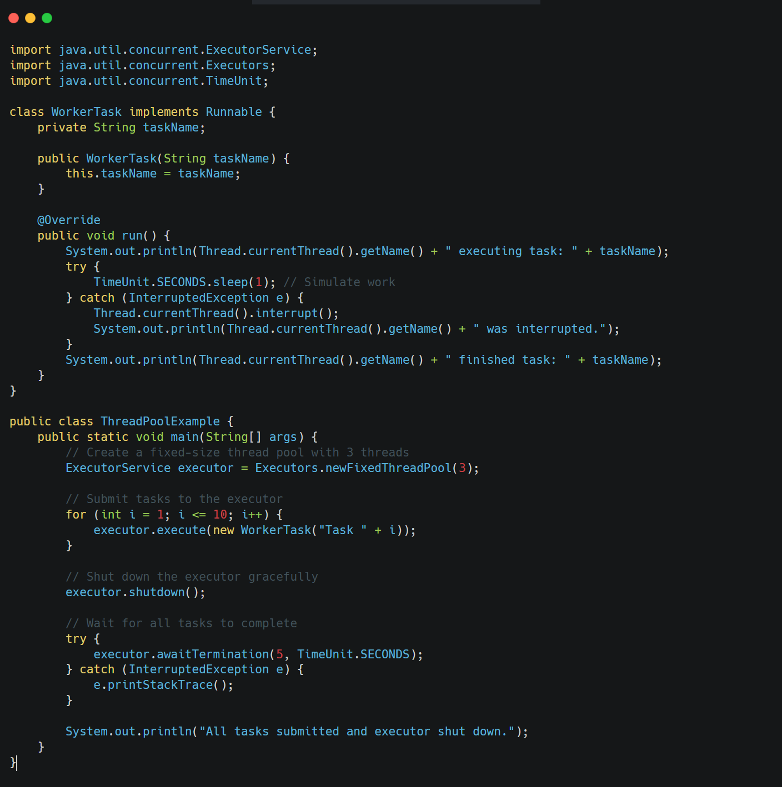

Implement a simple Thread Pool using `ExecutorService`. Explain the benefits of using a Thread Pool.

&nbsp;

* * *

&nbsp;

&nbsp;

Creating and managing threads manually for every task can be resource-intensive and lead to performance issues due to the overhead of thread creation and destruction. **A Thread Pool manages a set of worker threads that can execute multiple tasks.**

Benefits of using a Thread Pool:

- **Reduced Overhead:** Avoids the cost of creating and destroying threads for each task. Threads are reused.
- **Improved Performance:** Tasks can be executed concurrently by available threads.
- **Resource Management:** Limits the number of threads, preventing resource exhaustion.
- **Enhanced Responsiveness:** Tasks can be submitted quickly without waiting for thread creation.
- **Task Management:** Provides features like scheduling, task queues, and the ability to manage the lifecycle of submitted tasks.

&nbsp;

&nbsp;

We create a `FixedThreadPool` with 3 threads using `Executors.newFixedThreadPool(3)`.

We then submit 10 `WorkerTask` instances (which implement `Runnable`) to the executor using `executor.execute()`.

The thread pool's 3 threads will pick up and execute these tasks.

Once all tasks are submitted, `executor.shutdown()` is called to initiate a graceful shutdown. `awaitTermination()` is used to wait for the submitted tasks to complete within a given timeout. The output will show that tasks are executed by a limited number of threads from the pool.