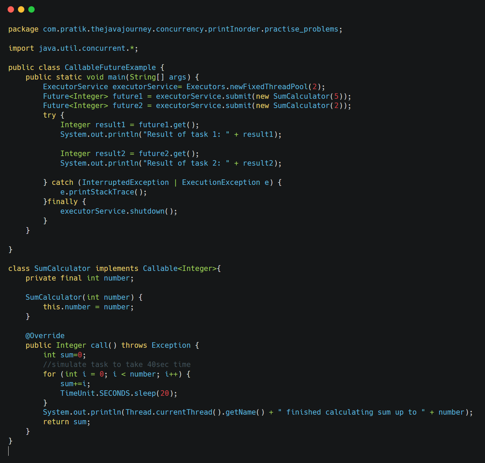

&nbsp;

&nbsp;

Explain `Callable` and `Future` in Java concurrency. Provide a code example using `ExecutorService` to execute a `Callable` and retrieve its result.

&nbsp;

&nbsp;

- **`Runnable` vs. `Callable`:**
    
    - `Runnable` is used for tasks that do not return a result and cannot throw checked exceptions Its `run()` method has a `void` return type.
    - `Callable` is used for tasks ==that return a result and can throw checked exceptions.== Its `call()` method returns a value of type `V` (generic).  
         
- **`Future`:**
    
    - Represents the **result of an asynchronous computation.**
    - Provides methods to check if the computation is complete, wait for its completion, and retrieve the result.
    - The `get()` method of `Future` blocks until the computation is complete and then returns the result. It can throw `InterruptedException` (if the waiting thread is interrupted) or `ExecutionException` (if the computation threw an exception).
    - The `isDone()` method checks if the task is complete without blocking.
    - The `cancel()` method attempts to cancel the execution of the task.  
         

`ExecutorService` can execute both `Runnable` and `Callable` tasks. When submitting a `Callable`, it returns a `Future` object.

&nbsp;

&nbsp;

`SumCalculator` implements `Callable<Integer>`, meaning its `call()` method returns an `Integer` result.

We create an `ExecutorService` and submit instances of `SumCalculator` using `executor.submit()`.

This returns `Future<Integer>` objects. We then call `future.get()` to retrieve the results.

The `get()` method blocks until the corresponding `Callable` task is completed.

The output shows the threads calculating the sums and the main thread retrieving and printing the results.