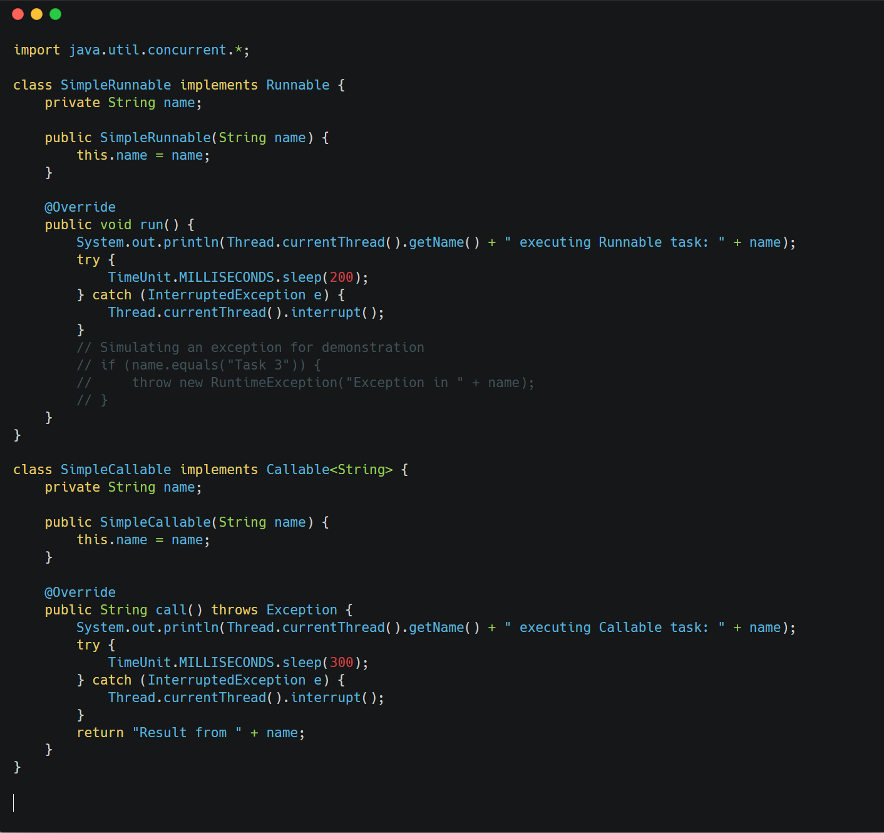
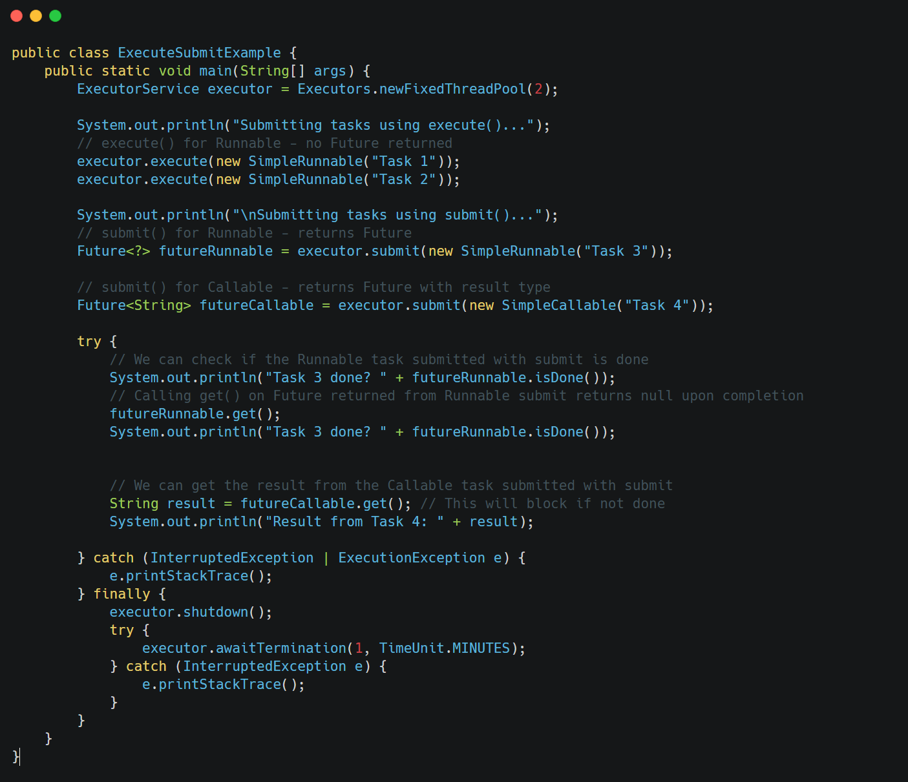

What is the difference between `execute()` and `submit()` methods of `ExecutorService`?

* * *

Both `execute()` and `submit()` are used to submit tasks to an `ExecutorService`, but they differ in their return type and the types of tasks they can accept.

&nbsp;

**execute(Runnable task):**

- Defined in the `Executor` interface (the superinterface of `ExecutorService`).
- Takes a `Runnable` task as input.
- Does not return any value.
- Cannot return the result of the task or check its status (completion, cancellation).
- Exceptions thrown by the `Runnable` task are usually logged only cannot be caught.

&nbsp;

**submit(Runnable task):**

- Defined in the `ExecutorService` interface.
- Takes a `Runnable` task or a `Callable` task as input.
- Returns a `Future<?>` (for `Runnable`) or `Future<V>` (for `Callable`).
- The returned `Future` can be used to get the result (for `Callable`), check the task's status, or cancel the task.
- Exceptions thrown by the task are wrapped in an `ExecutionException` and thrown when `Future.get()` is called.

&nbsp;

&nbsp;

