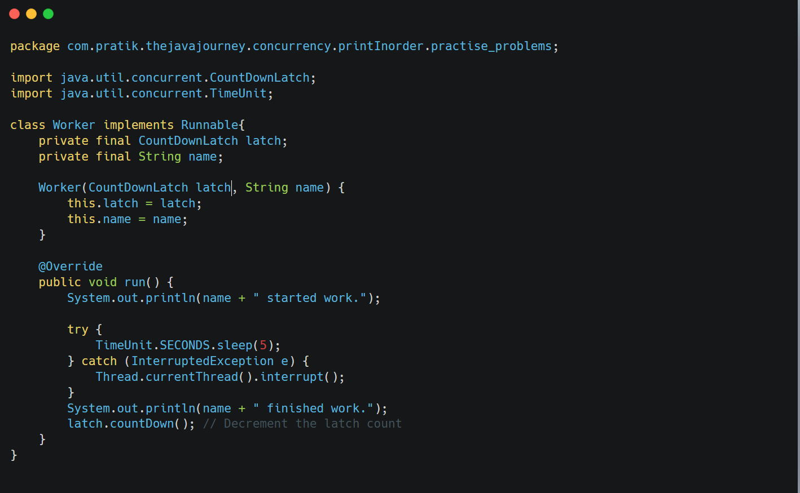
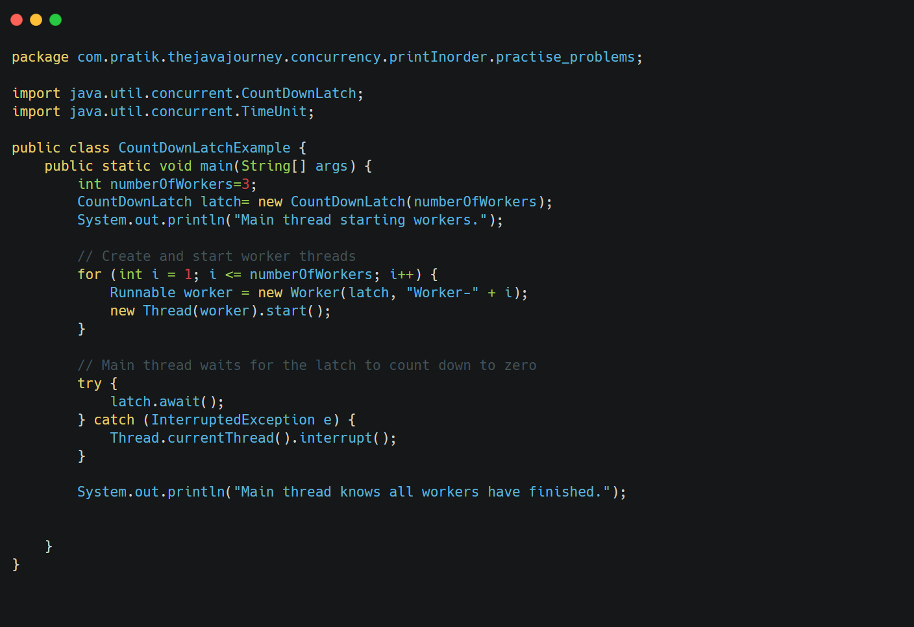

**Explain the purpose of CountDownLatch and CyclicBarrier. Provide a code example demonstrating the use of CountDownLatch.**

* * *

&nbsp;

**Both CountDownLatch and CyclicBarrier are ==synchronization aids used to coordinate multiple threads.==**

&nbsp;

&nbsp;

**`CountDownLatch`:**

- Initialized with a count.
- One or more threads wait for the count to reach zero.
- Other threads decrement the count.
- Once the count reaches zero, all waiting threads are released.
- It's a one-time event; the latch cannot be reused.
- **Useful for scenarios where you need to wait for a fixed number of operations to complete before proceeding.**

&nbsp;

**`CyclicBarrier`:**

- Initialized with a number of threads and an optional `Runnable` action.
- Allows a set of threads to wait for each other to reach a common barrier point.
- When all threads reach the barrier, they are released simultaneously.
- The barrier is *cyclic*, meaning it can be reused after the waiting threads are released.
- **Useful for scenarios where a set of threads need to perform a step, wait for all others to complete that step, and then proceed to the next step.**

&nbsp;

&nbsp;

&nbsp;

&nbsp;

We create a `CountDownLatch` with a count equal to the number of worker threads.

Each `Worker` thread, after completing its task, calls `latch.countDown()`.

The main thread calls `latch.await()`, which blocks until the latch's count reaches zero (meaning all workers have called `countDown()`).