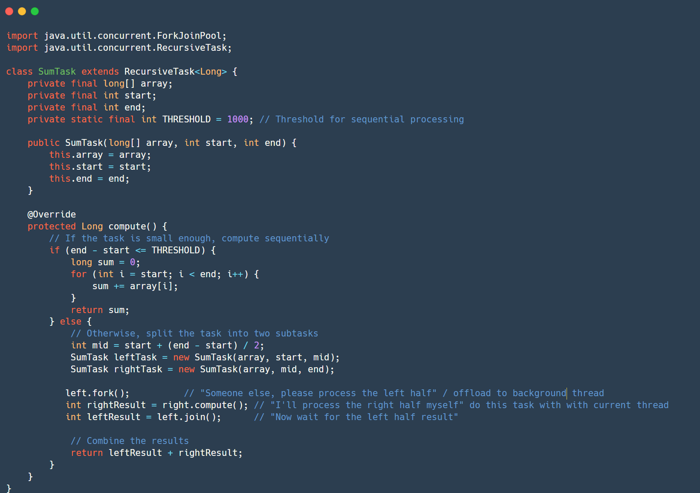
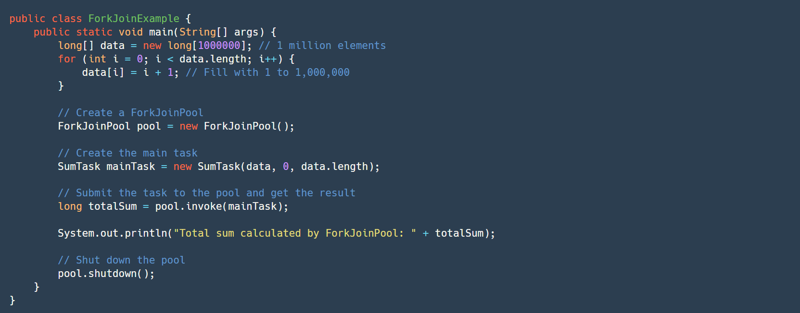

&nbsp;

Explain the concept of `ForkJoinPool` and when to use it. Provide a simple code example.

&nbsp;

`ForkJoinPool` is an implementation of the `ExecutorService` that is designed for tasks that can be recursively broken down into smaller subtasks. It is particularly effective for parallelizing divide-and-conquer algorithms.

  
Both  `ForkJoinPool`  and  `ExecutorService`  implement Executer Interface

The core idea behind `ForkJoinPool`is the "work-stealing" algorithm. When a worker thread finishes its own tasks, it can "steal" tasks from the deque (double-ended queue) of another worker thread that is still busy. This helps keep all worker threads busy and improves overall utilization.

&nbsp;

`ForkJoinPool` is best suited for:

- CPU-bound tasks (tasks that spend most of their time performing computations).
- Tasks that can be naturally broken down into smaller, independent subtasks.
- Recursive algorithms (like mergesort, quicksort, tree traversals)

&nbsp;

It's generally not suitable for I/O-bound tasks as worker threads would be blocked waiting for I/O, preventing work stealing.

&nbsp;

&nbsp;

&nbsp;

&nbsp;

&nbsp;

`SumTask` extends `RecursiveTask<Long>`, indicating it returns a `Long` result. The `compute()` method implements the divide-and-conquer logic.

If the sub-array size is below a `THRESHOLD`, it calculates the sum sequentially.

Otherwise, it splits the array into two halves, creates two `SumTask` subtasks, `fork()`s the left task (submitting it for asynchronous execution to background thread),

`compute()`s the right task (synchronously in the current thread or a worker thread do it myself), and then `join()`s the result of the forked task.

`join()` waits until the `left` task completes and returns its result.

The results are combined to produce the final sum. The `ForkJoinPool` manages the worker threads and the work-stealing.

&nbsp;

&nbsp;

&nbsp;

Unlike a regular `Thread.join()`, this one is **non-blocking** if possible — the current thread might even go and help execute the `left` task (via work-stealing).

&nbsp;

&nbsp;