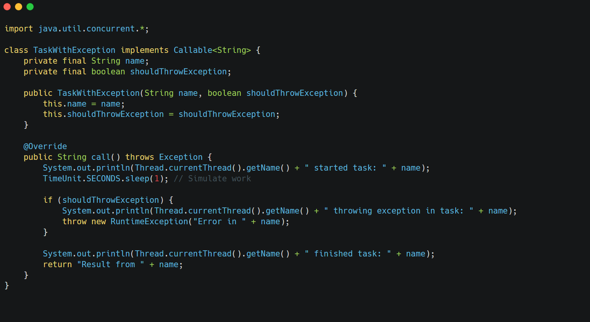
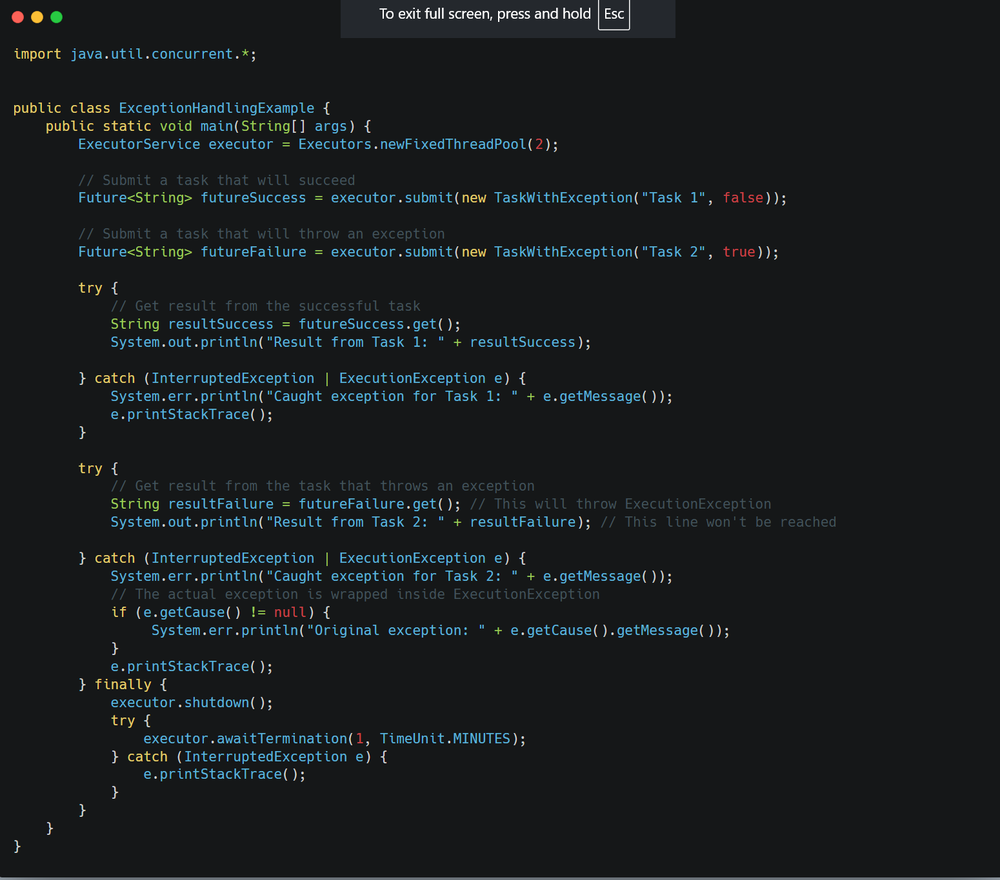

How can you handle exceptions in threads created using `ExecutorService`? Provide a code example.

&nbsp;

* * *

&nbsp;

&nbsp;

When a task submitted to an `ExecutorService` throws an exception, **the behavior depends on whether the task was submitted using execute() or submit()**

- **execute(Runnable task):**
    - **Exceptions thrown by the `run()` method are typically caught by the ExecutorService and handled by an uncaught exception handler (if configured) or simply logged. ==We don't get a direct way to catch the exception in the submitting thread.  
         ==**

- **submit(Runnable task) or submit(Callable task):**
    - When we use submit(), any exception ==thrown by the task's run() or call() method is captured and stored within the returned Future object.==
        
        **The exception is re-thrown as an ExecutionException when you call future.get()**. This allows the submitting thread to catch and handle the exception.
        

&nbsp;

* * *

&nbsp;

We define a `TaskWithException` `Callable` that can optionally throw a `RuntimeException`. We submit two instances to the `ExecutorService`, one that succeeds and one that fails. When we call `futureSuccess.get()`, it returns the result normally. When we call `futureFailure.get()`, it throws an `ExecutionException`. We catch this exception and can access the original exception using `e.getCause()`. This demonstrates the standard way to handle exceptions from tasks submitted via `submit()`.