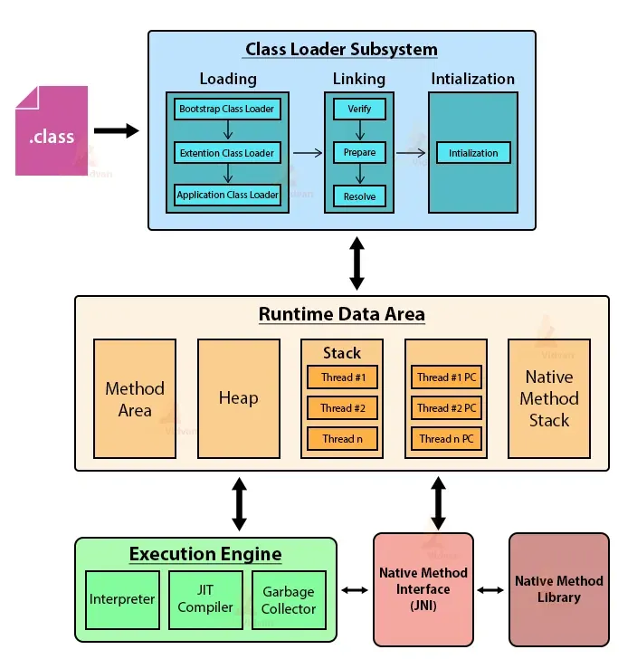

&nbsp;

#### 1\. **JVM Memory Structure**

The JVM memory structure is divided into several key areas, each playing a crucial role in the execution of a Java program:

- **Method Area**: This is a shared memory area where the class-level data (including bytecode, static variables, and constants) is stored. It also holds metadata about the loaded classes, including the runtime constant pool and the method data.
    
- **Heap**: The heap is the runtime data area from which memory for all class instances (objects) and arrays is allocated. The heap is shared among all threads in a Java application.
    
- **Stack**: The stack memory holds local variables and partial results. Each thread has its own JVM stack, which is created when the thread is created. Each stack frame in the stack corresponds to a method call.
    
- **PC Register**: Each thread has its own Program Counter (PC) register, which holds the address of the JVM instruction currently being executed.
    
- **Native Method Stack**: This memory area is used for storing the native method information. It supports native method execution using JNI (Java Native Interface).
    

```text
+---------------------+
|     Method Area     |   <- Loaded class data, constants, method data
+---------------------+
|         Heap        |   <- Objects and arrays
+---------------------+
|       Stack         |   <- Local variables and method call frames (per thread)
+---------------------+
|     PC Register     |   <- Current execution address (per thread)
+---------------------+
| Native Method Stack |   <- Native method data
+---------------------+

```

&nbsp;

#### **Class Loading Process in the JVM**

When a class is loaded by the JVM, several things happen in sequence:

1.  **Loading the Class File into the Method Area**:
    
    - The bytecode of the class is read from the class file.
    - The class loader (e.g., Bootstrap, Application) loads the class into the JVM.
    - The bytecode is stored in the Method Area. The Method Area includes:
        - **Class-level data**: Information about fields, methods, and interfaces.
        - **Runtime constant pool**: This contains references to constants, method references, and field references used in the class.
        - **Static variables**: These are also stored in the Method Area.
2.  **Linking**: The class is linked into the JVM runtime environment, which involves:
    
    - **Verification**: The bytecode is verified to ensure that it does not violate any JVM constraints (e.g., type safety).
    - **Preparation**: Memory for static fields is allocated in the Method Area, and they are initialized to default values.
    - **Resolution**: All symbolic references (e.g., method names, field names) in the runtime constant pool are replaced with direct references to memory addresses.
3.  **Initialization**: The JVM initializes the class by executing any static initializers (e.g., static blocks, initializing static fields).
4.  **Execution**: Once a class is initialized, the JVM can execute its methods. The JVM creates stack frames in the JVM stack for each method call. Each stack frame contains:
    
    - Local variables
    - Operand stack (for bytecode instructions)
    - Reference to the constant pool of the class

&nbsp;

### Detailed Breakdown of ClassLoader Interaction with JVM Memory

**Method Area Interaction**: When a class is loaded, all its bytecode, static fields, and runtime constant pool data are stored in the Method Area. The Method Area is shared across all ClassLoaders, meaning all classes loaded by different ClassLoaders reside in this common area.

**Heap Interaction**: While the Method Area stores class-level information, the Heap is where instances (objects) of those classes are created and managed. When a class's constructor is called, the JVM allocates memory from the Heap for the new object.

**Stack Interaction**: When a method is invoked, the JVM creates a new stack frame for the method in the JVM stack. This stack frame holds local variables, including references to objects in the Heap and constants from the Method Area. The execution of each method uses the operand stack within the stack frame to execute bytecode instructions.

&nbsp;

### ClassLoader Types and Their JVM Memory Interaction

- **Bootstrap ClassLoader**: It interacts with the Method Area to load core Java classes (like `java.lang.String`). These classes are crucial for the JVM's basic operation and are loaded from the `rt.jar` file in the JRE. The classes loaded by the Bootstrap ClassLoader have a special status in the JVM, as they form the foundation of the Java environment.
    
- **Extension (Platform) ClassLoader**: Loads classes from the extensions directory into the Method Area. These are typically classes that provide additional functionality to the core Java libraries (e.g., cryptographic libraries).
    
- **Application (System) ClassLoader**: Loads classes from the user-defined classpath into the Method Area. This is the ClassLoader used for loading the classes defined in your application.
    

&nbsp;

#### **Advanced ClassLoader Concepts**

- **Lazy Loading**: The JVM loads classes lazily, meaning a class is loaded only when it is first referenced. This optimizes memory usage and startup time. Lazy loading can be controlled by developers using custom ClassLoaders.
    
- **Class Unloading**: While the JVM loads classes, it does not automatically unload them. However, classes can be unloaded when the ClassLoader that loaded them becomes unreachable and no live references to the classes exist. This is particularly relevant in environments like application servers, where reloading modules or applications might be required.
    
- **JVM Internals for Class Resolution**: During the linking phase, the JVM resolves symbolic references to actual memory locations. This is done by looking up the runtime constant pool in the Method Area and replacing symbolic references with actual pointers to classes, methods, and fields.
    



&nbsp;

&nbsp;

&nbsp;

&nbsp;