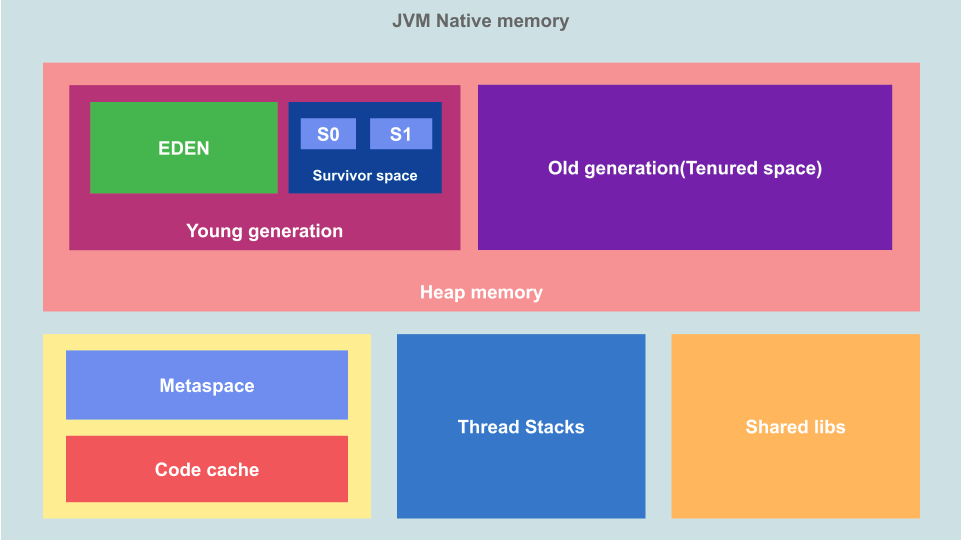

### Heap Memory:

This is where JVM stores object or dynamic data. This is the biggest block of memory area and this is where\*\*Garbage Collection(GC)\*\*takes place.

**Young generation**: Young generation or "New Space" is where new objects lives

- **Eden Space**: This is where new objects are created. When we create a new object, memory is allocated here.
- **Survivor Space**: This is where objects that survived the minor GC are stored.

**Old generation**: Old generation or\*\*"Tenured Space"\*\*is where objects that reached the maximum tenure threshold

## Thread Stacks

This is the stack memory area and there is one stack memory per thread in the process. This is where thread-specific static data including method/function frames and pointers to objects are stored.

## Meta Space

This space is used by the class loaders to store class definitions.

## Code Cache

This is where the\*\*Just In Time(JIT)\*\*compiler stores compiled code blocks that are often accessed,thereby reducing need to regenerate.

## Shared Libraries

This is where native code for any shared libraries used is stored. This is loaded only once per process by the OS.