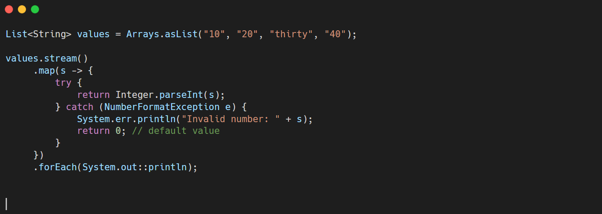
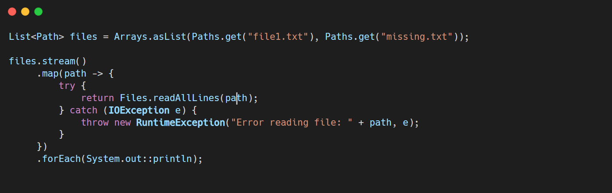

# 📝 Exception Handling in Java Stream API 

## ⚠️ Problem

- **Stream operations** like `map()`, `filter()`, etc., use functional interfaces (`Function`, `Predicate`, `Consumer`).
- These interfaces **do not allow checked exceptions** to be thrown directly.
- So, throwing or propagating **checked exceptions inside lambdas causes compilation errors**.

* * *

## ✅ Commonly Used Solutions

### 1\. **Handle Exceptions Inside Lambda**

Use a `try-catch` block **inside the lambda**. This is the most common and straightforward way.

#### Example:

> ✅ Pros: Simple, no extra code needed  
> ❌ Cons: Makes lambda bulky if logic is complex

* * *

### 2\. **Wrap Checked Exceptions as RuntimeExceptions**

Catch the exception and wrap it in a `RuntimeException`. Useful when you want to **fail fast** or propagate the error.

#### Example:

&nbsp;

> ✅ Pros: Clean for unrecoverable errors  
> ❌ Cons: Forces caller to handle `RuntimeException`

* * *

> &nbsp;

## 🧠 Best Practices

| Practice | Description |
| --- | --- |
| Prefer `try-catch` inside lambda | For simple, one-off cases |
| Wrap in `RuntimeException` | When you want to fail fast or rethrow |
| Use wrapper utilities | If you frequently work with I/O or parsing in streams |
| Avoid catching too broadly | Be specific about which exceptions you expect |

* * *

## 🚫 Not Recommended

- Trying to declare `throws Exception` in standard functional interfaces — won’t compile.
- Using external libraries just for this purpose unless already using them.

* * *

&nbsp;