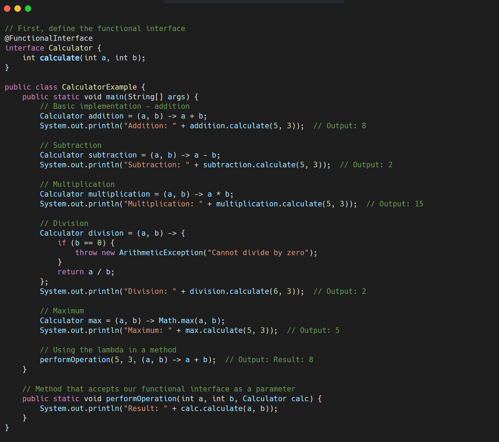
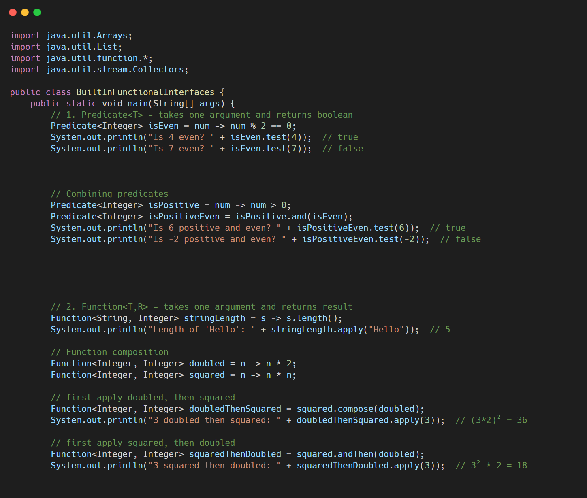
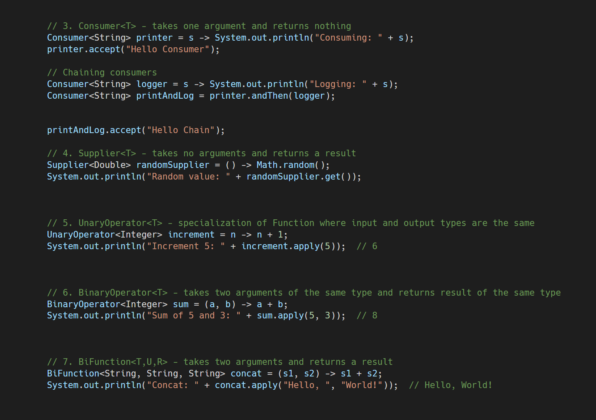
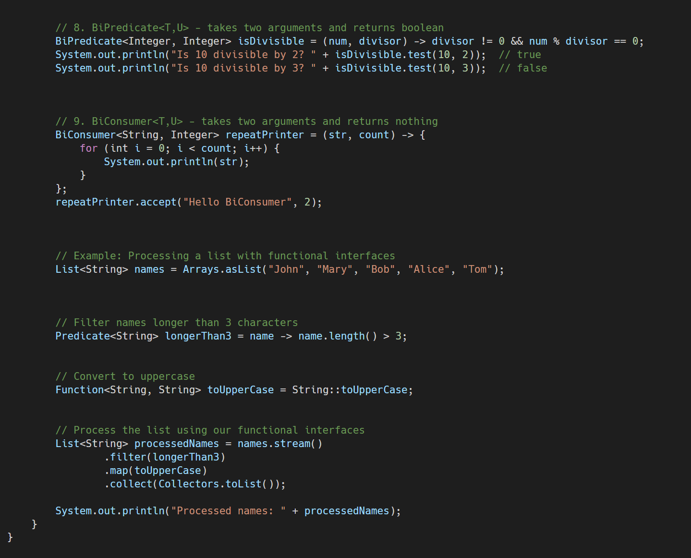

# Custom Lambda Expressions in Java

## Lambda Expressions Basics

**Lambda expressions in Java are a concise way to implement functional interfaces** - interfaces with a single abstract method (SAM). They were introduced in Java 8 and are a cornerstone of functional programming in Java.

&nbsp;



&nbsp;

&nbsp;

&nbsp;

## Common Built-in Functional Interfaces

Java provides several built-in functional interfaces in the `java.util.function` package. Let's explore how to use them:

&nbsp;



&nbsp;

&nbsp;



&nbsp;



&nbsp;

## Key Concepts and Interview Tips

Here are some key concepts and tips for tackling lambda expression questions in interviews:

### 1\. Lambda Expression Syntax

The basic syntax is:

```java
(parameters) -> { body }
```

- Parameters: Similar to method parameters
- Arrow token: Separates parameters from body
- Body: Contains expressions and statements

### 2\. When to Use Lambdas

- To implement functional interfaces (interfaces with a single abstract method)
- To create anonymous implementations of interfaces without verbose anonymous class syntax
- In stream operations for collections
- For event handling and callbacks
- For creating thread-safe, concise code

### 3\. Functional Interface Annotations

Always annotate your custom functional interfaces with `@FunctionalInterface`. This:

- Makes your intention clear
- Helps the compiler validate that the interface has exactly one abstract method
- Improves code readability

### 4\. Variable Capture Rules

When using variables from the enclosing scope:

- **Local variables must be effectively final** (not modified after initialization)
- Instance/static variables can be modified but should be thread-safe
- `this` refers to the enclosing instance, not the lambda

&nbsp;

### 5\. Method References

Instead of:

```java
(str) -> str.length()
```

You can use:

```java
String::length
```

Types of method references:

- Static method reference: `ClassName::staticMethod`
- Instance method of a particular object: `instance::method`
- Instance method of an arbitrary object of a particular type: `ClassName::method`
- Constructor reference: `ClassName::new`

### 6\. Common Interview Questions

1.  What is a lambda expression in Java?
2.  What is a functional interface?
3.  What are the advantages of lambda expressions?
4.  What are the limitations of lambda expressions?
5.  How do lambda expressions relate to anonymous classes?
6.  Can lambda expressions access variables from their enclosing scope?
7.  What are method references and when should you use them?
8.  How would you implement a custom functional interface?
9.  What is the difference between a lambda expression and a closure?
10. How do lambdas improve collection processing?

## Practice Problems for Interviews

To prepare for interviews, try implementing these common scenarios with lambda expressions:

1.  Create a method that takes a list of strings and returns only those meeting a custom condition (filter)
2.  Create a method that transforms each element in a list based on a provided function (map)
3.  Create a custom sorting mechanism for a list of objects
4.  Implement a simple command pattern using lambdas
5.  Create a method that processes a list of elements and returns a single result (reduce)
6.  Create a method that executes an operation with proper exception handling
7.  Implement a basic event handling system using lambdas
8.  Create a factory pattern implementation using lambdas

Would you like me to provide implementations for any of these practice problems?