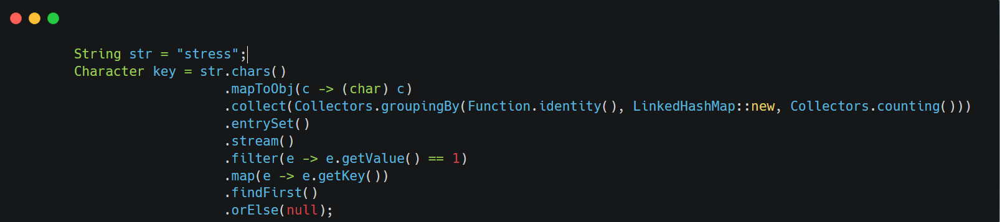

&nbsp;

**Given a string, find the first character that appears only once (non-repeating) in the string.**

**Input: "stress"  
Output: 't'**

&nbsp;

* * *

**Solution:**

1.We find character count ,  
 collect it into LinkedHashMap to preserve order

2\. we create stream from entrySet of collected LinkedHashMap

3\. then we filter entries with values as 1

4\. map entries to key and return the first one

&nbsp;

****